<!-- ============================================================== -->
<!-- AUTHORING SOURCE. JV 2026-07-12: iterate HERE and regenerate   -->
<!-- the .docx from this .md for as long as JV has not edited the   -->
<!-- .docx in Word himself — he will say so explicitly when that    -->
<!-- starts. FROM THAT MOMENT the .docx is the master: regenerating -->
<!-- would silently destroy his Word edits (screenshots, styling);  -->
<!-- large additions then go into a NEW file (e.g.                  -->
<!-- Manual_addition.docx) merged by hand in Word.                  -->
<!-- ============================================================== -->


# Introduction

## What ClassBuilder is

ClassBuilder is a **model-driven C++ code generator**. You design an object-oriented data model — classes, members, methods, relations, inheritance — in a graphical environment, and ClassBuilder writes the corresponding `.h` and `.cpp` source files for you. The generated code is complete, compilable C++: class declarations, constructors and destructors, relation maintenance code, iterators, optional serialization, and optional undo/redo support.

The emphasis is on **design first, correct by construction**. The mechanical parts of an object model — the parts that are tedious to write and easy to get subtly wrong — are generated from a single description:

- **Relations between objects** are implemented as *intrusive linked lists*: fast, allocation-free containers whose maintenance code (insert, remove, cascade delete, iterator bookkeeping) is generated and hidden behind a handful of macros, so the source you actually read stays free of plumbing.
- **Ownership** is a property of a relation. If every class is reachable from a top class through owned relations, destroying the top object frees the entire object graph — *no leaks by design*.
- **Iterators are self-maintaining**: objects can be added or deleted — including the element you are standing on — while you iterate, without invalidating the loop.
- **Serialization** (save/load of the whole object graph, with schema versioning) and a complete **undo/redo framework** can be generated on top of the same model.

ClassBuilder is a **round-trip** code generator, not a one-off wizard: your own logic lives in clearly marked, designated regions inside the generated files (user blocks, method bodies, note comments), and **Read Source** parses hand edits made there **back into the model**. Regeneration rewrites everything around those regions — never their content. You can develop in your IDE for days, read the changes back, regenerate, and nothing of yours is lost; the model and the source cannot drift apart.

> **Historical note — document generation.** Earlier (Windows-only) versions could also generate *documentation* from the model — with the same round-trip idea — into RTF. That feature was bound to Windows and RTF is no longer a common interchange format, so it has been dropped for the moment. It may return in a different form: the building blocks (vector SVG export of every diagram, and the command interface that lets scripts and AI systems walk the entire model) are already in place.

ClassBuilder is **self-hosted**: the sources of ClassBuilder are generated by ClassBuilder, from a model that ships with the program. Every mechanism described in this manual is exercised daily by the tool itself.

ClassBuilder is a **cross-platform tool**: the same application runs on **Windows, macOS and Linux** (it is built on Qt), and a `.cbz` model file is byte-identical across platforms — design on one machine, continue on another. The generated code and the runtime headers are portable C++ that compiles with MSVC, Clang and GCC alike. Keyboard shortcuts are written as `Ctrl+...` in this manual; on macOS read `Cmd (⌘)` wherever `Ctrl` is named — the mapping is automatic.

The four screenshots below show what that means in practice: roughly the same situation — the Matrix model open, its tree next to the *Matrix Overview* class diagram — captured on four different platforms.

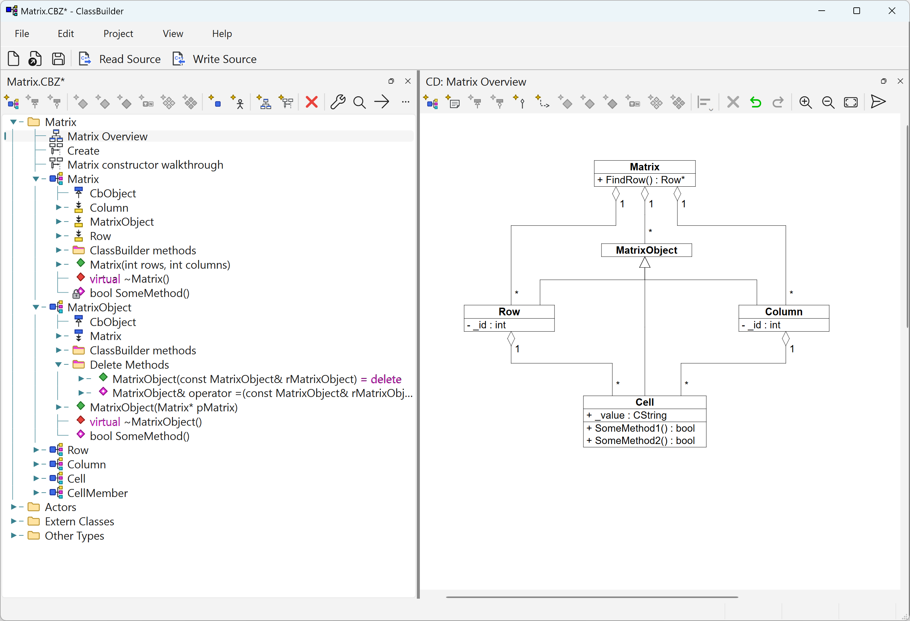

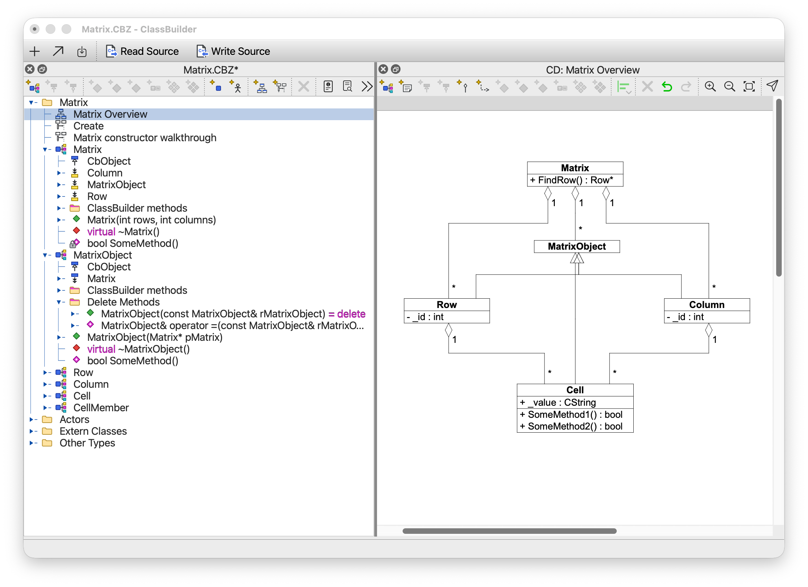

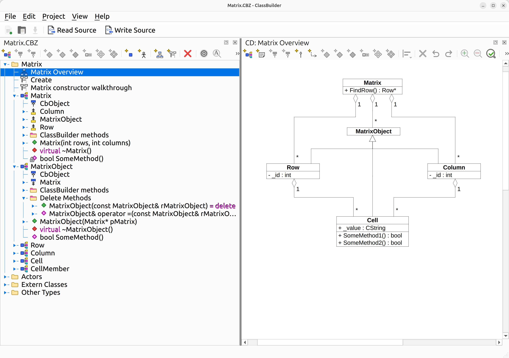

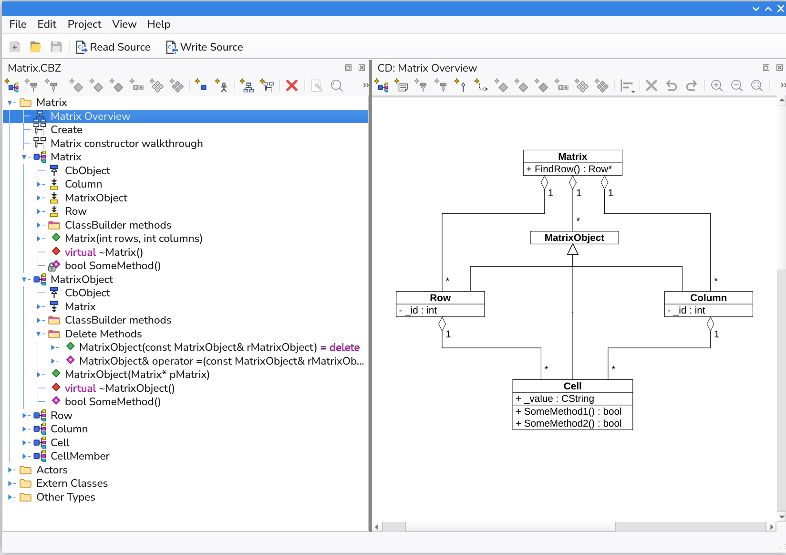

## The pieces

| **Piece** | **What it is** |
|----------------|--------------------------------------------------------|
| `ClassBuilder.exe` | The GUI application (Qt-based; Windows, macOS and Linux). |
| The model file (`.cbz`) | Your design, stored as a Zstandard-compressed binary archive. |
| Generated sources | One `.h` + one `.cpp` per class, plus a master include file. |
| Runtime headers | A small library of `CB_*.h` headers (plus value types and the serialization runtime) that generated code compiles against. |
| Command interface | A JSON-over-TCP API through which scripts — or AI systems — can read and modify the live model. |

## About this manual

The manual has three parts. **Getting started** (chapters 2–4): concepts and vocabulary, project setup, and a hands-on quick start that builds a small model, generates code, compiles and runs it — after chapter 4 you can start working. **Reference** (chapters 5–10): the application shell, the tree, the two diagram views, every dialog, and the code editor — organized so you can look up *"what are the toolbar buttons / menu items / context-menu entries / mouse and key gestures in this view"*. **In depth** (chapters 11–16): code generation, the intrusive-list runtime, serialization, undo/redo, the replace constructor, and the command interface, followed by best practices and the appendix.

The examples use the **Matrix** model — a matrix of cells owned simultaneously by their row and their column — which is small enough to read in one sitting yet touches almost every feature.

## Notation: keyboard shortcuts per platform

This manual writes every shortcut in **one notation only — the Windows/Linux form** (`Ctrl+S`, `Ctrl+Shift+C`, `F3`, `Alt`+drag). If you work on macOS, translate with this table; it is not repeated elsewhere in the document:

| **This manual writes** | **Windows / Linux** | **macOS** |
|-----------------------------|--------------------------|--------------------------|
| `Ctrl+`key (e.g. `Ctrl+S`) | `Ctrl+`key | `⌘`+key |
| `Ctrl+Shift+`key | `Ctrl+Shift+`key | `⌘⇧`+key |
| `F3` (find next) | `F3` | `⌘G` |
| `Alt`+drag | `Alt`+drag | `⌥`+drag |
| `Del` | `Del` | `⌫` |

Two things make this safe to rely on: ClassBuilder's menus and tooltips always display the binding that is active **on your platform** (they are authoritative when in doubt), and mouse gestures (click, drag, wheel, middle-drag) are identical everywhere.

> **Figures.** Screenshots in this manual show ClassBuilder on Windows 11 (except the platform gallery in section 1.1). Diagram figures are SVG exports produced by ClassBuilder itself (via `export_diagram_svg`, chapter 16).

# Concepts and terminology

## The model

A **model** (document) is the unit you open, edit and save — one `.cbz` file. It contains:

- **Classes** — the classes ClassBuilder will generate code for.
- **Extern classes** — classes that exist *outside* the model (`CbObject`, `CbArchive`, library types, your own hand-written classes). They can be inherited from and referenced, but no code is generated for them.
- **Types** — non-class types usable for members/arguments (`int`, `void`, plus any you add: `CString`, enums, typedefs with their declaration text).
- **Relations** — directed, named links between two classes (chapter 12).
- **Inheritances** — which class inherits from which, each with its access (public/protected/private) and optional `virtual` modifier.
- **Groups** — folders that organize a model, at three levels. *Inside a class*, a group collects members and/or methods — the coloured bar on its folder icon tells what is inside: cyan for members, magenta for methods, both colours for a mix. *Above the classes*, a ClassGroup collects classes that belong together. *At the top level*, next to the model root, a MetaGroup collects ClassGroups. Groups are purely organizational — they do not change the generated code.
- **Class diagrams** and **sequence diagrams** — graphical views onto the model.
- **Actors** — external parties that appear on sequence diagrams.
- **Project settings** — output naming, prefixes, indentation, comment headers, serialize/undo options, phase support.

Everything lives in one tree (chapter 6); diagrams are views of the same underlying objects — a class renamed in a dialog changes everywhere at once.

## Class features

- **Members** — data members, with type (+ `*`, `&`, `[]`, const, mutable, bit-field...), access, static flag, initialization value, optional generated **getter/setter**, a **serialize flag** and a **version** (chapter 13).
- **Methods** — with return type, arguments (each with type/default), access, `virtual` / `static` / `const` / pure (`= 0`) / inline / `= delete`, calling convention, and a **body** that you write and that round-trips between the model and the source file.
- **Constructors / destructor** — special methods. Constructor argument lists are largely *derived*: for every relation the class participates in as a child, the constructor takes the owner pointer(s); the generated `ConstructorInclude(...)` call splices the new object into those relations.
- **Notes** — free documentation text on nearly every element; emitted as comments above the declaration.

## Phases

With **Phase Support** enabled (Project Settings), every element carries a lifecycle phase — *Analysis, Design, Implementation, Test, Complete* — shown as a second icon in the tree and usable as a tree filter. Purely organizational, no effect on generated code.

## Generated vs. user code

Generated files are divided into regions (chapter 11). Only three kinds of places are yours to edit on disk:

- `//@START_USERn ... //@END_USERn` blocks (extra includes, declarations, helper code),
- method bodies between `{//@CODE_nnnn` and `}//@CODE_nnnn`,
- note comments `/*@NOTE_nnnn ... */`.

Everything else is rewritten on the next **Write Source**. **Read Source** parses your on-disk edits in those regions back into the model.

# Installation and project files

## The application

`ClassBuilder.exe` is a single executable (Qt linked statically on Windows). Installing is copying it; associate `.cbz` files with it for double-click opening. On start-up it also opens the command-interface TCP port (chapter 16).

## What generated code needs — the runtime headers

Generated code `#include`s a small, header-only runtime. Ship these directories with your project (or point your include path at them):

| **Directory** | **Contents** | **Needed** |
|------------|--------------------------------------------------|-----------|
| `include/` | `CB_Multi.h`, `CB_MultiOwned.h`, `CB_Single.h`, `CB_SingleOwned.h`, tree/static/critical variants, `CB_IteratorMulti.h`, `CB_CriticalSection.h`, ... | always |
| `value/` | `CbString.h`, `CbTime.h`, `CbColor.h`, `CbGeometry.h` — small value types | when used by your model |
| `serialize/` | `CbSerialize.{h,cpp}` (CbObject/CbArchive runtime), `CbZstdStream.{h,cpp}` + the zstd library | only with Serialize on |

The generated **master include** (e.g. `MatrixInclude.h`) pulls in exactly the `CB_*` headers the model's relations need, in the right order, plus all class headers — twice: once for declarations, once (under `CB_INLINES`) for inline bodies.

## StdAfx.h — the one file you write

With the *StdAfx.h* code-generation option on (the default), every generated `.cpp` begins with `#include "StdAfx.h"`. That file is **yours**, written once per project; it maps the model's type names onto real headers and includes the master include. The quick start's version:

```cpp
// StdAfx.h -- master include for the Matrix sample project.
#ifndef _STDAFX_H
#define _STDAFX_H

#include <assert.h>

#include "CbString.h"       // ClassBuilder value-type string
typedef CbString CString;   // the model's 'CString' type maps onto CbString

#include "CbSerialize.h"    // CbObject / CbArchive / CB_*_SERIAL macros

#include "MatrixInclude.h"  // generated master include

#endif
```

This illustrates a general point: **types in the model are just names**. The model says a member has type `CString`; your project decides what that name means.

## Output locations

Each class stores its target file names (`.h` / `.cpp`, class dialog); paths are relative to the model file's directory. **Write Source** (`File` menu, toolbar, or the `write_source` command) regenerates them; it also saves the model, so model and sources stay in step.

# Quick start — the Matrix model

This chapter builds a complete model, generates the code, compiles it with a small `main.cpp`, and runs it. Everything shown — generated code, console output, diagrams — is real output produced while writing this manual.

**The design.** A `Matrix` owns `Row`s and `Column`s; every `Cell` is owned **twice** — it sits in its Row's list *and* its Column's list. Deleting a Row must delete its Cells and those Cells must silently vanish from their Columns too. This "one object in several owned containers" pattern is painful with standard containers and is exactly where ClassBuilder shines.


## Step 1 — create the model

`File ▸ New...` opens the new-model wizard.


Choose **Serialize** support and document class `Matrix` (chapter 13 explains what is scaffolded: an extern `CbObject`, the document class `Matrix`, the polymorphic root `MatrixObject`, and the relation between them). Two rules to know now:

- Serialize is a **one-time choice** per model — pick it if in doubt; undo/redo (also enable-once) requires it.
- Every serialize-enabled class **single-inherits** from the document-object root, directly or transitively; the GUI enforces this.

## Step 2 — add the classes

In the tree, right-click the model node ▸ `Add ▸ Class` (or `Ctrl+Shift+C`), and create `Row`, `Column`, `Cell` — each with Serialize on, which auto-inherits them from `MatrixObject`.


## Step 3 — add members

Right-click `Row` ▸ `Add ▸ Member` (`Ctrl+Shift+B`): type `int`, name `id` — **bare name, no underscore**: the class's member prefix (default `_`) is added at generation time, so the emitted member is `_id`. Set access *private* and Get method *Public*: a `GetId()` getter is generated (and stays in sync if you retype the member). Repeat for `Column` (`id`, same settings) and `Cell` (`value` of type `CString`, public, no getter).

The model's format **version** needs no member and no code: it is the *Version* field in the DataModel dialog (visible in the Step 1 figure). ClassBuilder handles the rest invisibly — the generated document `Serialize` writes the version into every save and uses it when reading older files back; chapter 13 shows how that supports evolving the model.


## Step 4 — add the relations

Right-click `Matrix` ▸ `Add ▸ Relation` (`Ctrl+Shift+R`) and create, all of kind **Multi** with **Aggregation** (owned) checked:

| **From** | **To** | **Meaning** |
|----------|----------|--------------------------------------------|
| `Matrix` | `Row` | the matrix owns its rows |
| `Matrix` | `Column` | the matrix owns its columns |
| `Row` | `Cell` | a row owns its cells |
| `Column` | `Cell` | a column owns the *same* cells |

That double ownership of `Cell` is deliberate — the runtime supports one object in any number of intrusive lists (chapter 12).


## Step 5 — constructors, with real code in the bodies

Right-click each class ▸ `Add ▸ Constructor` (`Ctrl+Shift+U`). ClassBuilder **derives the argument list**: `Row`'s constructor automatically takes `(Matrix* pMatrix)` — the owner — plus whatever you add (here: `int id`). The generated body begins with `ConstructorInclude(pMatrix)`, which splices the new Row into the matrix's list; below the `// Put in your own code` marker the body is yours.

Give `Row` this body (the code editor auto-indents C++). It walks the matrix's Columns and creates one Cell per column — using a **generated iterator**:

```cpp
Matrix::ColumnIterator iColumn(pMatrix);
while (++iColumn)
{
    (void)new Cell(this, iColumn, "");
}
```

`Column`'s constructor mirrors it (one Cell per existing Row) — the symmetry means Rows and Columns can be added in any order later and the cell grid stays complete. `Cell`'s constructor just takes its two owners plus the value; its `ConstructorInclude(pRow, pColumn)` splices it into **both** lists. The constructor `Matrix(int rows, int columns)` creates the grid:

```cpp
for (int c = 0; c < columns; c++)
{
    (void)new Column(this, c);
}

for (int r = 0; r < rows; r++)
{
    (void)new Row(this, r);
}
```

Note what is *absent*: no container declarations, no push_back, no bookkeeping. Creating an object with its owner as argument **is** the insertion.

## Step 6 — a find method

Right-click the `Matrix→Row` relation ▸ add a **Find Method** on member `id`. The generated `FindRow(int id)` iterates the relation and compares — and if the relation used a tree implementation, the same dialog generates the fast tree lookup instead (chapter 12.8):


```cpp
Row* Matrix::FindRow(int id)
{//@CODE_3308
    RowIterator iRow(this);
    while (++iRow)
    {
        if (id == iRow->GetId())
        {
            return iRow;
        }
    }

    return 0;
}//@CODE_3308
```

## Step 7 — a class diagram

Right-click the model node ▸ `Add ▸ Class Diagram`, name it *Matrix Overview*, and add the five classes (`Select Classes...` from the diagram's context menu, or drag them from the tree). `Optimize Placement` lays them out.


The Matrix Overview class diagram as exported by ClassBuilder (Export SVG). Diamonds mark owned (aggregation) relations; `1`/`*` are the multiplicities. The view hosting the diagram is a window of its own:


A diagram view opens **floating** over the shell — this is the initial state of every diagram view.


The same view **docked**: drag it onto an edge of the main window — here the right edge, giving the usual tree-beside-diagram split; the top and bottom edges split horizontally the same way.


Or **tabbed**: drop it onto the tree's tab bar and the views share the full window, one tab each.

## Step 8 — generate the source

`File ▸ Save Source...` (toolbar: **Write Source**). One `.h` + one `.cpp` per class appear next to the model, plus `MatrixInclude.h`. This is the actual generated `Cell.h` (abridged header comment):

```cpp
#ifndef _CELL_H
#define _CELL_H

//@START_USER1
//@END_USER1

class Cell
    : public MatrixObject
{
    CB_DECLARE_SERIAL(Cell)
    RELATION_MULTI_OWNED_PASSIVE(Row, Row, Cell, Cell)
    RELATION_MULTI_OWNED_PASSIVE(Column, Column, Cell, Cell)

//@START_USER2
//@END_USER2

// Members
private:

protected:

public:
    CString _value;

// Methods
private:
    void ConstructorInclude(Row* pRow, Column* pColumn);
    void DestructorInclude();
    void SerializeConstructorInclude();

protected:
    Cell();
    virtual void Serialize(CbArchive& archive);
    virtual void SerializeRelations(CbArchive& archive,
                                    MatrixObject* pointerArray[]);

public:
    Cell(Row* pRow, Column* pColumn, CString value);
    virtual ~Cell();
};

#endif
```

The two `RELATION_MULTI_OWNED_PASSIVE` macros are Cell's memberships in its Row's and Column's lists — the link pointers (`_refRow/_prevRow/_nextRow`, `_refColumn/_prevColumn/_nextColumn`) become members *of the Cell itself*. The `.cpp` contains the constructors/destructor with your bodies, followed by the generated relation and serialize machinery. That machinery sits between a pair of guard comments:

```cpp
//{{AFX DO NOT EDIT CODE BELOW THIS LINE !!!
    ... generated relation / serialize implementations ...
//}}AFX DO NOT EDIT CODE ABOVE THIS LINE !!!
```

The guards mean exactly what they say: everything between them is regenerated on every **Write Source**, so a hand edit there is lost — your code belongs in the user sections and `//@CODE` bodies (chapter 11 lists every editable region).

## Step 9 — compile and run

A minimal driver (`main.cpp`) exercises the model — construction, iteration from both sides, find, cascade delete, deletion *during* iteration, and a save/load round-trip:

```cpp
Matrix* pMatrix = new Matrix(3, 4);

// fill values by iterating rows -> cells
Matrix::RowIterator iRow(pMatrix);
while (++iRow)
{
    int c = 0;
    Row::CellIterator iCell(iRow);
    while (++iCell)
    {
        char buf[32];
        sprintf(buf, "r%dc%d", iRow->GetId(), c++);
        iCell->_value = buf;
    }
}

// the same cells, reached through a Column's list
Matrix::ColumnIterator iColumn(pMatrix);
while (++iColumn) { /* ... print iColumn's cells ... */ }

Row* pRow = pMatrix->FindRow(1);
delete pRow;                        // cascade: row's cells leave the columns too

// save -> destroy -> reload (Zstd-compressed archive, chapter 13)
{
    std::ofstream raw("matrix.dat", std::ios::binary);
    CbZstdOutBuf zbuf(raw);
    std::ostream zos(&zbuf);
    CbArchive ar(zos);
    pMatrix->Serialize(ar);
}
delete pMatrix;
Matrix* pLoaded = new Matrix();     // serialize ctor: empty shell
{
    std::ifstream raw("matrix.dat", std::ios::binary);
    CbZstdInBuf zbuf(raw);
    std::istream zis(&zbuf);
    CbArchive ar(zis);
    pLoaded->Serialize(ar);
}
```

The data file's extension is yours to choose (`.dat` here) — just avoid `.cbz`, which is the extension of ClassBuilder's own model files and typically associated with the application.

Compiled with the generated files + runtime headers (here with GCC; MSVC works identically):

```
g++ -std=c++17 -I. -Iinclude -Ivalue -Iserialize \
    main.cpp Matrix.cpp MatrixObject.cpp Row.cpp Column.cpp Cell.cpp \
    serialize/CbSerialize.cpp serialize/CbZstdStream.cpp -lzstd -o matrixdemo
```

The actual run:

```
created: 3 rows x 4 columns
  column 0:  r0c0(row 0)  r1c0(row 1)  r2c0(row 2)
  column 1:  r0c1(row 0)  r1c1(row 1)  r2c1(row 2)
  column 2:  r0c2(row 0)  r1c2(row 1)  r2c2(row 2)
  column 3:  r0c3(row 0)  r1c3(row 1)  r2c3(row 2)
FindRow(1) -> row 1 with 4 cells
first column has 3 cells before the delete
first column has 2 cells after deleting row 1
after mid-iteration delete: 1 rows left
reloaded: 1 rows x 4 columns, first cell 'r2c0'
done -- every object freed by cascade, no leaks by design
```

Read those middle lines again: deleting one `Row` made its cells disappear from every `Column` — no code was written for that. A row was deleted *while iterating the rows* — the loop just continued. The whole surviving structure round-tripped through a compressed binary file. That is the value proposition of ClassBuilder in eleven lines of console output.

**Without compression.** The Zstd frame is optional. `CbArchive` reads and writes a plain `std::istream` / `std::ostream` — it takes the store-or-load direction from the stream type — so you can hand it the file stream directly and drop the compression layer entirely. The code is a few lines shorter and the build no longer needs the Zstd library (`serialize/CbZstdStream.cpp` and `-lzstd` both come out). The only trade-off is file size: the archive is stored uncompressed, where the full CBZ path is roughly 8–9× smaller on real models (chapter 13). For small models, or simply to keep the build dependency-free, plain is perfectly fine:

```cpp
// save -> destroy -> reload (uncompressed: no Zstd)
{
    std::ofstream raw("matrix.dat", std::ios::binary);
    CbArchive ar(raw);                  // ostream -> storing
    pMatrix->Serialize(ar);
}
delete pMatrix;
Matrix* pLoaded = new Matrix();
{
    std::ifstream raw("matrix.dat", std::ios::binary);
    CbArchive ar(raw);                  // istream -> loading
    pLoaded->Serialize(ar);
}
```

Built without the Zstd pieces:

```
g++ -std=c++17 -I. -Iinclude -Ivalue -Iserialize \
    main.cpp Matrix.cpp MatrixObject.cpp Row.cpp Column.cpp Cell.cpp \
    serialize/CbSerialize.cpp -o matrixdemo
```

## Step 10 — the round trip

Edit a generated body **on disk** (inside its `//@CODE` markers), switch back to ClassBuilder, and use `File ▸ Read Source...` (**Read Modifications**): the model absorbs your edit. If ClassBuilder itself has the file's model open when the source changes, it offers the read-back automatically — accept it, or your next Write Source will overwrite the edit. Model ↔ source is a two-way street.

# Reference: the application shell

## Menus

| **Menu** | **Items** |
|------------|------------------------------------------------------------------|
| **File** | New... (`Ctrl+N`) · Open... (`Ctrl+O`) · Close Model (`Ctrl+W`) · Save (`Ctrl+S`) · Save As... · Save Source... · Read Source... · Delete Source · Exit |
| **Edit** | Undo (`Ctrl+Z`) · Redo (`Ctrl+Y`) |
| **Project** | Settings... · Add Serialize... · Refresh Object IDs |
| **View** | New Window · Zoom In (`Ctrl++`) · Zoom Out (`Ctrl+-`) · Zoom Full · UI Scale ▸ 100% / 125% / 150% / 175% / 200% |
| **Help** | About ClassBuilder... |

*Save Source / Read Source* are the code-generation round trip (chapter 11). *New Window* opens a second full tree of the active model. The zoom items act on the active diagram view.

**UI Scale** enlarges the whole application — text, icons, dialogs — independently of the operating system's display scaling: useful on a monitor whose system scaling you don't want to change, or when ClassBuilder alone should be bigger. It is a per-machine setting (stored per user, not in the model) and takes effect after a restart — picking a scale offers to restart ClassBuilder right away. Not to be confused with the Zoom items, which magnify only the active diagram canvas.

## The main toolbar

| **Button** | **Icon** | **Enabled when** |
|-------------------|----------------------------|--------------------------------------|
| New | new-document glyph | always |
| Open | open-folder glyph | always |
| Save | diskette glyph | a model is open **and** modified |
| Read Source | text button | the model has been saved to a path |
| Write Source | text button | the model has been saved to a path |

Undo/Redo are deliberately **not** on the main bar: with several models open they would be ambiguous. They live on each view's own toolbar (tree and diagrams), and always act on *that view's* model.


## Docking

Every view — model trees, class diagrams, sequence diagrams, scoped sub-window trees — lives in the same docking system:

- A model's **tree** opens docked in the main window; each further model becomes a **tab** next to it (the tab is its drag handle).
- A **diagram** view opens **floating** by default. Drag it onto the main window to place it: drop it on a pane's tab row to add it as a **tab**, or on a pane edge to **split** (side by side with the tree or another diagram) — drop indicators show the targets while dragging.
- The same drag works in reverse: any docked pane can be dragged out to float again. A floating window always holds a **single view**: tabbing and splitting happen inside the main window only.
- Closing a model's tab closes the model (with a save prompt when modified).

## Platforms and keys

One binary behavior set on Windows, macOS and Linux, with these platform notes:

- **Shortcuts**: this manual uses Windows/Linux notation only — the translation table lives in chapter 1 (*Notation*). Menus and tooltips always display the binding active on your platform.
- **AltGr rule**: accelerators avoid `Ctrl+Alt` combinations because on European layouts they collide with AltGr characters — the Add accelerators are all `Ctrl+Shift+...`.
- **macOS specifics**: ClassBuilder uses Qt's file dialogs (not the native panels), dock tabs are left-aligned, and the tree adds a hover highlight and adjusts branch-triangle colors on selection — cosmetic parity fixes only; features are identical.
- The **status bar** shows Width/Height/X/Y of the shape under the cursor in diagram views.

# Reference: the main tree view

The tree is the master view of a model: every element of the model, shown in its structure. Several models can be open at the same time — each model's tree gets its own tab in the main window — and like every other view it can also be split off or floated (chapter 5.3).

## What the tree shows

The model node at top (with class diagrams, sequence diagrams and top-level classes under it), the `Actors`, `Extern Classes` and `Other Types` nodes, groups, and under every class: inheritances, members, methods (with full signatures), constructors/destructor, arguments, relations, and the generated **Relation methods** in their own folder — visible but owned by the generator. Every node type has its own icon; with Phase Support on, a phase glyph joins it.

## The tree toolbar

Button order, with each button's accelerator (all `Ctrl+Shift+...` on purpose: `Ctrl+Alt` combinations collide with AltGr on European keyboard layouts). A button is enabled exactly when the action is legal on the current selection — the same gate the context menu uses.

| **Button** | **Key** | **Icon glyph** |
|-----------------------------|----------------|--------------------------------|
| Add Class | `Ctrl+Shift+C` | class box |
| Add Inheritance | `Ctrl+Shift+I` | inheritance triangle |
| Add Relation | `Ctrl+Shift+R` | relation line |
| Add Member | `Ctrl+Shift+B` | member diamond |
| Add Method | `Ctrl+Shift+M` | method diamond |
| Add Constructor | `Ctrl+Shift+U` | constructor diamond |
| Add Type | `Ctrl+Shift+Y` | type block |
| Add Virtual Methods | `Ctrl+Shift+V` | paired diamonds |
| Add IsClass Methods | `Ctrl+Shift+S` | paired diamonds (Is) |
| Add Argument | `Ctrl+Shift+A` | argument |
| Add Actor | `Ctrl+Shift+T` | stick figure |
| Add Class Diagram | — | class-diagram thumbnail |
| Add Sequence Diagram | — | sequence-diagram thumbnail |
| Delete | `Del` | cross |
| Filters... | — | wrench |
| Find... / Next | `Ctrl+F` / `F3` | magnifier / arrow |
| Undo / Redo | `Ctrl+Z` / `Ctrl+Y` | arrows (per-view, act on this model) |

Three additions have accelerators but no button: **Group** `Ctrl+Shift+G`, **Meta Group** `Ctrl+Shift+P`, **External Class** `Ctrl+Shift+E` (X was unavailable — it is an OS hotkey).

The toolbar **wraps**: the tree itself needs little width, but the button strip does, so when the tree pane is made narrow the buttons flow onto a second (or third) row instead of being clipped — the strip grows a row taller rather than demanding width.


## The element icons

The element icons speak one visual language, shared with the diagrams and the toolbar, and drawn from SVG (the legacy `.ico` set is the fallback). The legend below uses the actual icon files, so it cannot drift from the application.

**Structure and elements:**

| **Icon** | **Element** | **Icon** | **Element** |
|------|---------|------|---------|
|  | model root |  | class |
|  | extern class |  | type |
|  | inheritance |  | argument |
|  | class diagram |  | sequence diagram |
|  | actor |  | group (folder) |

The extern class is the class square without the yellow relations tab — an extern class is declared outside the model, so it has no generated relations. The group folder's coloured bar tells what is inside:  members,  methods,  a mix.

**Members and methods** — the diamond colour is the *kind*:

|  |  |  |  |
|------|------|------|------|
| member | method | constructor | destructor |

Access is an overlay (public is bare):

|  |  |  |
|------|------|------|
| public | protected (key) | private (padlock) |

The fill tells the body state — an untouched method keeps its place's shade on the rim:

|  |  |  |  |
|------|------|------|------|
| code in the `.cpp` | inline (darker) | no code yet (hollow) | inline, no code yet |

`virtual` and `= delete` are not on the icon: the tree paints those keywords in magenta in the signature text itself.

**Relations** — the arrow encodes the relation on the node it hangs under. Heads: one = Single, two = Multi. Colour: grey = plain association, black = owned (aggregation), magenta = critical, red = critical **and** owned. The box marks the side: yellow box at the bottom = the *from* (active) side pointing at its targets; blue box at the top = the *to* (passive) side being pointed at. Static relations draw thicker, with a wider box. Each pair below shows the *from* and *to* icon of the kind:

|   |   |   |   |   |   |   |
|------|------|------|------|------|------|------|
| single | multi | owned | critical | critical + owned | static | static + owned |

**Phases** — with Phase Support on, the phase marker joins the element icon:

|  |  |  |  |  |
|------|------|------|------|------|
| Analysis | Design | Implementation | Test | Complete |

## The context menu

Right-click any node (an unselected node is selected first). The full menu, top to bottom — items appear/enable per node type:

1. **Open** — the double-click action: attribute dialog, the code editor for methods with bodies, the view for diagram nodes.
2. **Edit Attributes** — the element's dialog (chapter 9).
3. **Edit User Sections** / **Edit Section ▸** — a class's six free-code sections, or jump straight to one (*Before/Inside/After class definition `.h`*, *Before/After master include, After generated code `.cpp`*).
4. **Edit Exception Specification** — per-method exception clause.
5. **Edit Context / Assign Context** — define contexts on the model node, assign them on classes/methods (chapter 9, *Context*).
6. **Copy / Paste** (`Ctrl+C` / `Ctrl+V`) — subtree copy, also **across models**: copy a class in one model, paste into another.
7. **Sort on Name / Sort on Phase** — sort the children that carry a free order (classes, groups, diagrams); members and methods keep their fixed built-in order (see *Ordering of members, methods, and groups*).
8. **Add ▸** — everything addable here: Class Diagram, Sequence Diagram, Group, Class, External Class, Inheritance, Relation, Member, Method, Constructor, Argument, Meta Group, Actor, Virtual Methods, IsClass Methods, Type — plus *Deleted Copy Ctor + operator=* on a class (adds both as `= delete` in one click).
9. **Print ▸** — on a **class**, *Header (.h)* or *Implementation (.cpp)*; on the **model** node, the *Master Include*. Prints the freshly generated file — syntax-coloured and line-numbered — through the browser (see *Printing*).
10. **Phase ▸** — Analysis / Design / Implementation / Test / Complete.
11. **Base Classes / Derived Classes** — read-only inheritance-hierarchy browsers.
12. **New Sub Window** — a second, *scoped* tree rooted at this node, as its own dockable view.
13. **Delete Multiple...** — bulk delete (below).

Which entries are enabled follows from the clicked node — the same gate as the toolbar buttons. Below, the menu on a class, with the Add submenu open:

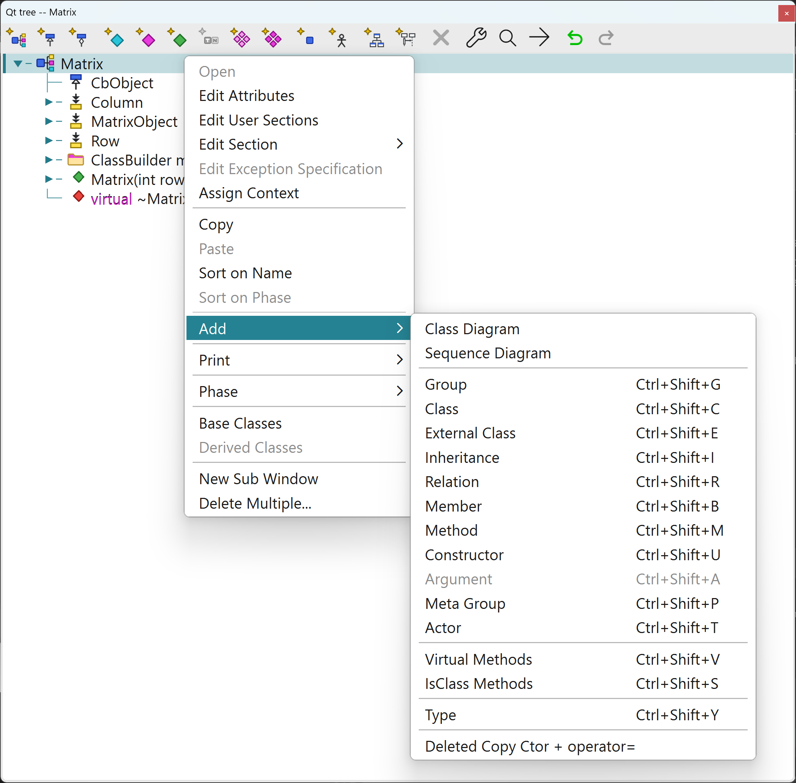

## Filters

**Filters...** opens the filter panel: per element kind, choose what stays visible — access levels and static/non-static for members and methods, relation kinds (inheritance, multi/single, aggregation/association), classes with or without a constructor, and (with Phase Support on) the phases. The filter is **per tree view**: filtered nodes disappear from that tree only. Diagrams are unaffected — what a diagram shows is its own explicit choice (Select Classes and the per-class display options).

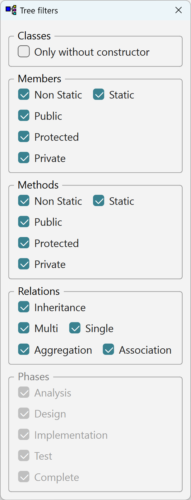

## Delete Multiple

`Delete Multiple...` shows a checkbox tree scoped to the clicked node, with type filters and Select All — tick everything to remove and delete it as **one undo step**. The fastest way to clean up an imported or experimental model.

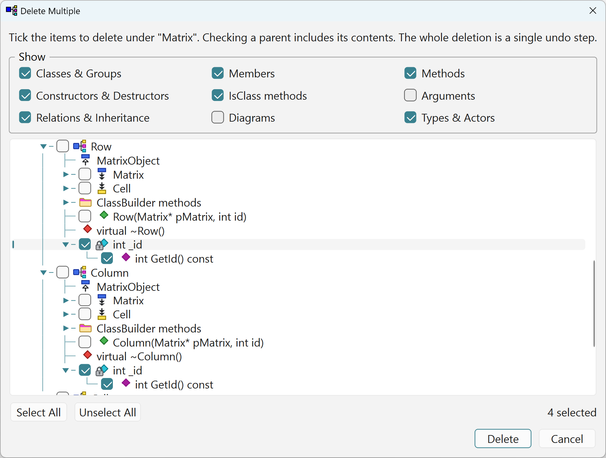

## Drag, and copy-drag

Dragging in the tree is move-or-copy:

- **Plain drag** = **move**: the node re-parents under the drop target (the model validates which parents are legal per element type; illegal targets simply don't highlight). The dragged row lifts out of the tree while dragging.
- **`Ctrl`+drag** = **copy**: the ghost cursor gains a green **+** badge and the original stays put — this is how you clone a member/method subtree onto another class quickly.
- Valid drop targets highlight with a tinted row and an accent bar at the left edge.

Everyday examples: drag an **argument onto a method** to add it there (`Ctrl`+drag to copy it from another method — the fast way to replicate a signature); drop a **type** node — a Class, Extern Class or Other Type — **onto a method** to add a new argument *of that type*; the same move/copy works for members and methods between classes, and for classes between groups.

**Tree → diagram** (hold `Ctrl` and drag over an open diagram view):

- onto a **class diagram**: a class node drops as a new class shape at the cursor (a ghost of the shape previews while hovering);
- onto a **sequence diagram**: a class or actor drops as a new lifeline.

## Ordering of members, methods, and groups

The tree always shows members and methods in a **fixed, built-in order** — there is no way to drag them up or down to re-order them. Within a class:

- **Members** are grouped by access and sorted by name (static members kept apart).
- **Methods** come constructors first, then the destructor, then by access and name (static apart); the generator's own **relation methods** come last.

That is a *display* order. Underneath it sit two different rules, and the difference matters:

- **A member's position in the model is its creation order, and it is load-bearing.** Members are generated — and **serialized** — in the order they were created. The `Serialize` code writes each member in that order and reads them back in the same order, so re-ordering members would break loading of any file written by an earlier build (see *Serialization*). That is exactly why there is no gesture to move a member: the order is not yours to change. Add a new member and, in the model, it goes *last* — the tree merely slots it into its sorted place.
- **Methods carry no such constraint** — they are code, not stored data — so ClassBuilder keeps the method list sorted for you; adding or editing a method re-sorts it, and the tree and the generated file always agree.

**Groups are how you impose your own order.** Drag a member or method into a **Group** (or **Meta Group**) to collect related items under a heading. Groups — unlike the members and methods themselves — *can* be re-ordered (drag them) and sorted:

- **Sort on Name / Sort on Phase** (context menu) sort the children that carry a free order — **classes, groups and diagrams** — never the members and methods inside them. On a class with no groups they therefore do nothing visible, which is expected, not a bug.

The same rules show through in the generated file: in the header the declarations are grouped `private → protected → public` (by name within each); in the `.cpp` the definitions follow the model order — constructors, destructor, then methods, with the generator's own methods below the `//{{AFX DO NOT EDIT` line (see *Anatomy of a generated file*). Member declarations keep their creation order, per serialization above.

# Reference: class diagrams

A class diagram shows selected classes as UML boxes with their inheritances, relations and dependencies. A model can have any number of diagrams; each shows a chosen subset of classes and features — small focused diagrams beat one wall-sized one.

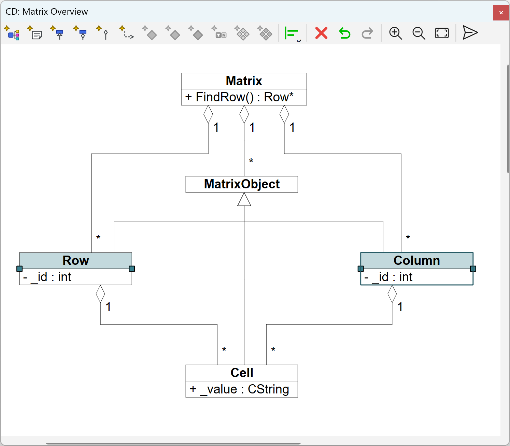

## Reading the diagram

- **Class box**: name, then members / methods. The diagram's auto-add setting (its dialog) decides which access levels appear when a class is *first placed*; after that, which individual features appear is per-shape via `Select Members & Methods...`.
- **Inheritance**: triangle-headed arrow to the base.
- **Relation**: line with a **diamond on the owner side when owned** (aggregation); multiplicities `1`/`*` at the ends; the role names optionally shown (`Show Relation Names`).
- **Dependency**: dashed arrow with a name and a stereotype (`<<uses>>`-style) — a documentation-only "uses" link; like Relation (Diagram Only), it changes nothing in the generated code.
- **Relation (Diagram Only)**: looks like a relation but exists **only in the drawing** — nothing is added to the model and nothing is generated. Use it for documentation-only connections.
- **Notes**: free-text boxes, attachable by connection points to other shapes.

## Selection

- **Click** selects the shape under the cursor (clicking an already-selected shape keeps the selection, so a drag can follow). Clicking empty space clears the selection.
- **`Ctrl`+click toggles** a shape in/out of the selection; **`Shift`+click always adds**.
- **Rubber band**: drag from empty space — shapes **fully enclosed** by the dashed box are selected (with `Shift`: added to the selection).
- **`Ctrl+A`** selects all top-level shapes; **`Esc`** clears the selection (or cancels whatever drag/placement is in progress).
- When several things overlap, the hit-test prefers the small things first: connection text labels, then note connection points, then connection segment handles, then resize handles, then shape bodies.
- Selected shapes are outlined (and lightly filled) in the accent color. The **last-selected** class/note carries a darker frame: it is the **anchor** that Align works against.
- A right-click on an unselected shape selects it first, then opens the context menu.

## Moving and resizing

- **Move**: drag any selected shape — a multi-selection moves as a block (dashed ghost outlines preview the landing spots). Connections between two moved shapes translate along; connections to unmoved shapes re-route.
- **Resize**: classes and notes have **left/right edge handles** (cursor becomes a horizontal double arrow). Width is clamped to a minimum; height is derived from content. Manually resizing a class turns its *Auto Width* off (re-enable via the context menu).

## Editing connection routing

Connections are orthogonal poly-lines that you can reshape — select the connection first:

- **Middle segments** slide perpendicular to their direction (a vertical segment moves left/right — horizontal double-arrow cursor; a horizontal one moves up/down). Movement snaps to the grid and is clamped so the routing stays legal; a dashed ghost previews the result.
- **End points** slide along the class perimeter (four-arrow cursor). The whole path re-routes live: the preview shows the complete re-routed connection — arrowheads, diamonds and all — as a dashed ghost.
- **Move all — `Alt`**: hold `Alt` while dropping and every sibling connection that shares the same routing moves together. This is how you move the **shared trunk of all inheritance lines** of a base class in one gesture: drag any one of them with `Alt`, and every collinear sibling follows. The same applies to `Alt` on a shared start point.
- **Text labels** (relation role names and multiplicities, dependency name/stereotype) are draggable on a selected connection (four-arrow cursor, snaps to the grid). A label's position is held **relative to the connection anchor point** it belongs to — the *from* labels to the start point, the *to* labels to the end point — so once you place a label it keeps that offset and travels with its anchor point when the connection re-routes or its class moves.

## Members and methods inside the box

- A member/method **row** is individually selectable. **Double-click** opens it: a **method** opens its **code editor** — a separate window that may open *behind* the diagram, so bring it to the front if you don't see it — while a **member** opens its **attributes dialog**. **`Ctrl`+double-click** opens the **attributes dialog** instead (for a method, its signature — name, return type, arguments, flags — rather than its body).
- **Reorder by drag**: press on an already-selected row and drag vertically — a horizontal insertion line shows the landing slot. Members reorder among members, methods among methods. This order is **local to the diagram**: a class box can show only a subset of the class's members/methods, and each diagram keeps its own arrangement, so reordering here changes only how *this* box is laid out — it does **not** change the declaration order in the generated file.
- Arrow keys walk the rows of a class (header ↔ members ↔ methods).

## Notes and their connection points

Notes attach to other shapes with connection lines whose points are **positional** ("semi-attached"): a point that lies inside a shape's rectangle travels with that shape when it moves — nothing is hard-wired, so you can park a point anywhere.

- Drag a note's **corner point outward** to spawn a new point (the attach-line grows a joint); drag a point **back inside the note** to delete it.
- While dragging, a dashed line plus a small square marker previews the geometry.

## Creating elements on the canvas

- **Key + drag** (the fastest way): hold a key, then drag from one class to another — the cursor becomes a crosshair, a dashed line follows the drag, and the target class highlights:
  - **R** — Relation (dialog opens on drop; `Cancel` creates nothing)
  - **I** — Inheritance (drag **from base to derived**)
  - **D** — Dependency
  - **O** — Relation (Diagram Only)
  - One gesture per key press; `Esc` cancels mid-drag.
- **Placement modes**: `Add ▸ Class` (`Ctrl+Shift+C`) or `Add ▸ Note` (`Ctrl+Shift+N`) arm a crosshair with a footprint ghost; click to place (the class/note dialog opens), right-click or `Esc` to cancel.
- **From the selection**: select the *from* class, `Shift`+click the *to* class, then use `Add ▸ Relation` / `Add ▸ Inheritance` — the dialog opens pre-filled with the pair in selection order.
- `Add ▸` also creates members/methods/constructors/arguments directly on the selected class or method — same dialogs as the tree.
- **Deleting** a shape asks whether to remove it *from the diagram* or *from the model*.

## Align

Select two or more classes/notes and align them to the **anchor** (the last-selected shape, marked with the darker frame): **Left / Center / Right** (horizontal) and **Top / Middle / Bottom** (vertical) — from the context menu's `Align ▸` submenu or the toolbar's align dropdown. `Optimize Placement` (≥ 2 classes) auto-lays-out the whole diagram instead.

## Hiding, per-shape toggles, colors

- **Hide** removes selected connections from view (per diagram); **Show Hidden** brings them back directly — all of them, or, with a class selected, just that class's hidden connections.
- Per-class toggles: **Auto Width**, **Show Method Arguments**. Per-relation: **Show Relation Names**.
- **Change Line Color... / Change Text Color...** recolor the selected shapes.
- **Color Templates ▸** sets the **document-wide default colors** — class line/text, member text, method text, relation line/critical-relation line/text, inherit line, diagram-only line/text, dependency line/text, note line/text. Each opens a color picker seeded with the current value; the change applies to every diagram of the model (and is undoable).

## Zoom and pan

| **Input** | **Effect** |
|----------------------------|------------------------------------------------|
| `Ctrl`+wheel (or trackpad pinch) | zoom in/out, anchored at the cursor |
| `Ctrl+=` / `Ctrl+-` / toolbar | zoom one step in/out |
| Toolbar *Fit* / `Ctrl+0` | reset to fit-to-window |
| wheel / trackpad scroll | pan |
| middle-mouse drag | pan (closed-hand cursor) |
| scrollbars | pan |

Zoom ranges from 0.1× to 32×; the status bar's X/Y fields track the model coordinates under the cursor.

## The CD toolbar

In order: **Add Class**, **Add Note** (both arm placement) · **Add Inheritance**, **Add Relation**, **Add Relation (Diagram Only)**, **Add Dependency** (enabled per selection) · **Add Member / Method / Constructor / Argument / Virtual Methods / IsClass Methods** (enabled when a single suitable target is selected) · **Align** dropdown (≥ 2 alignable) · **Delete** (any selection) · **Undo / Redo** · **Zoom In / Zoom Out / Fit** · **Export SVG**.


## The CD context menu

One menu serves the whole canvas: which entries are enabled follows from what is selected — the same gate as the toolbar buttons. Below, the menu on an **empty selection**: the diagram-level actions are available (adding a class or note, Select Classes, Color Templates, Optimize Placement), while everything that needs a shape — Open, Edit Attributes, Align, Hide — waits for one.

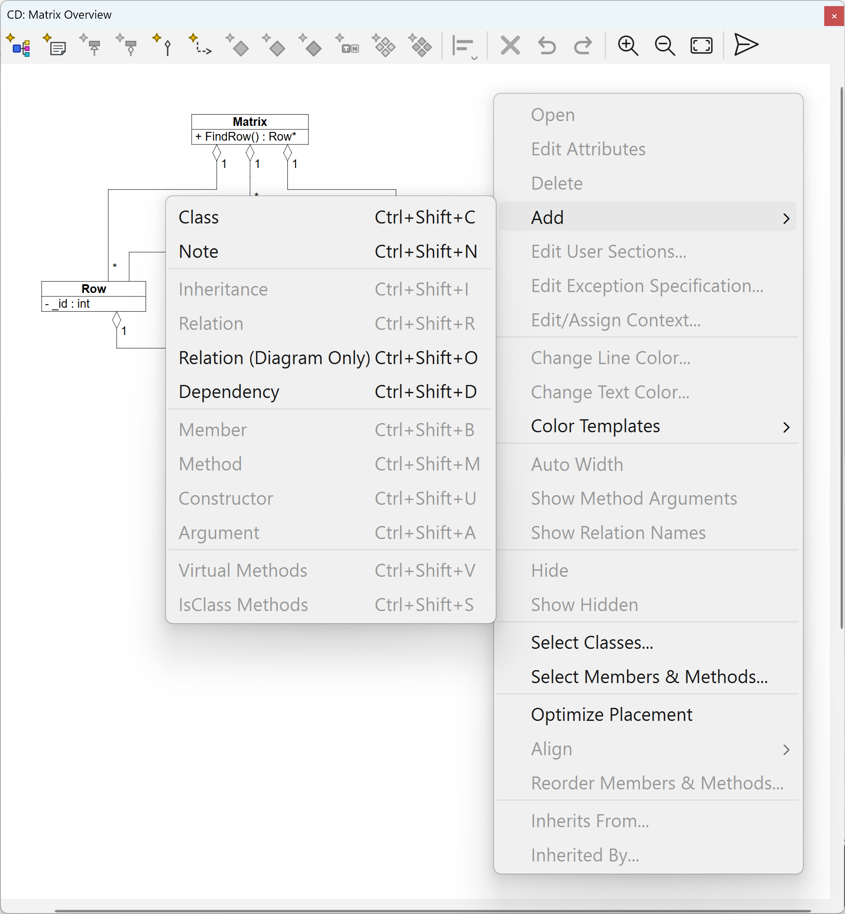

## Canvas keys

| **Key** | **Action** |
|----------------------|------------------------------------------------|
| `R` / `I` / `D` / `O` + drag | create relation / inheritance / dependency / diagram-only |
| `Ctrl+Shift+C/N` | arm Add Class / Add Note placement |
| `Ctrl+Shift+I/R/O/D/B/M/U/A/V/S` | the Add actions (as on the tree) |
| `↑` / `↓` | walk the rows of the selected class |
| `Del` | delete selection |
| `Esc` | cancel placement/drag/rubber-band, else clear selection |
| `Ctrl+A` | select all |

# Reference: sequence diagrams

Sequence diagrams show *interactions*: which object calls what, in which order. Lifelines (classes or actors) run vertically; **activations** (the narrow boxes) are nested calls; **messages** (signals) are the arrows between them. Activations can be bound to a real method of the model — the diagram then knows the signature, and `Open` on the activation jumps straight into the method's code editor.


## Building one

1. `Add ▸ Sequence Diagram` on the model/class/group node; the dialog sets numbering style (`1`, `1.1.1`, `a`, ...), whether message labels show argument types/names/scope, caption, scale.

    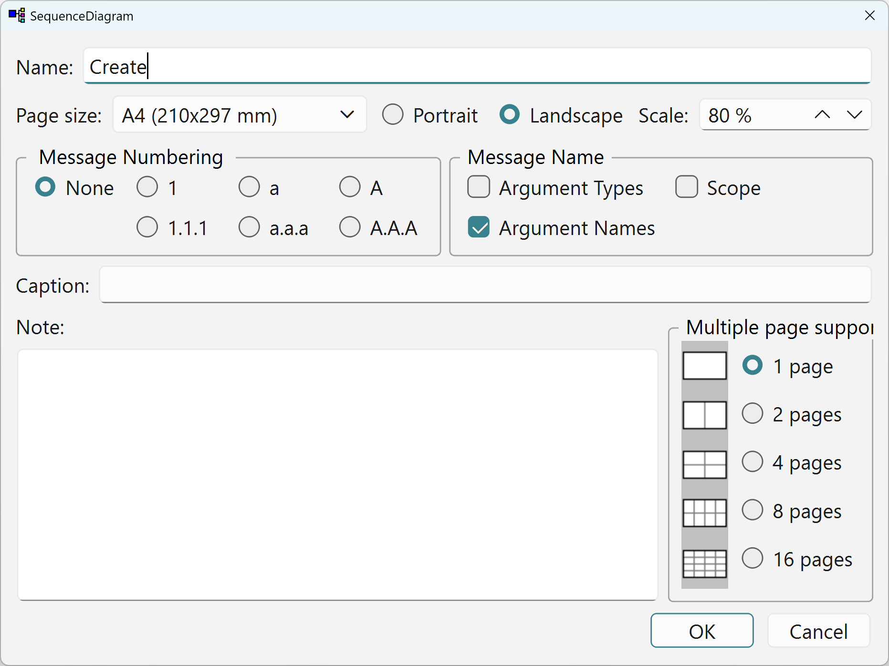

2. Add lifelines: `Add ▸ Lifeline` (`Ctrl+Shift+L`) then click on the lifeline row, `Ctrl`+drag classes/actors in from the tree, or `Add ▸ Class` to create a class and its lifeline in one go.
3. Create messages **by dragging**: press on a sender activation and drag onto a target — another activation, or a lifeline body (which creates the receiving activation). A dashed preview line follows the drag and the cursor becomes a pointing hand over a valid target; on drop the message dialog opens to bind a method (`Cancel` creates nothing). Creation/destruction flags mark constructor/destructor semantics. Self-calls and cycles are refused.
4. Notes: free boxes with attach-lines — see below.

## What moves, and how

| **What** | **Gesture** | **Notes** |
|--------------------------|-------------------------|----------------------------------------|
| Receiving activation | drag the **message arrow** up/down | vertical only; clamped to its container; dashed ghost |
| Sending activation | `Alt` + drag the arrow | same drag, other end |
| Activation among siblings | `Ctrl+↑` / `Ctrl+↓` (or context menu Move Up/Down) | reorders the call sequence |
| Lifeline | drag its head left/right, or `Ctrl+←` / `Ctrl+→` | horizontal only; siblings shift aside |
| Signal texts (name, guard label, return) | drag, on a selected signal | free 2-D offset, grid-snapped |
| Note | drag body / left-right edge handles | move / resize |
| Note attach-line points | drag the point | see below |

**Notes and their points.** Like class-diagram notes, attach-line endpoints are **semi-attached**: purely positional, so a point lying on a lifeline or signal travels with it. Dragging a corner point outward spawns a new joint; dragging a point back into the note deletes it. On release, a point near a signal arrow snaps vertically onto it — the line then tracks that signal.

## Keeping it readable

Three context-menu layout commands (each one undo step):

- **Optimize Placement** — reorders lifelines to minimize crossings, packs horizontally, resets offsets.
- **Space Lifelines** — even horizontal spacing, order preserved.
- **Reset Activation Offsets** — clears manual vertical tweaks.

`Collapse Activations to Note` replaces a selected group of nested activations with a summarizing note — good for hiding boilerplate sub-calls.

## Toolbar, colors, zoom

- **Toolbar**: Add Lifeline, Add Note, Add Class (placement/dialog) · Delete · Undo / Redo · Zoom In / Out / Fit · Export SVG.


- **Colors**: per-shape `Change Line/Text Color...`, plus the document-wide **Color Templates ▸** for the sequence-diagram defaults (lifeline, activation, signal and note line/text colors) — same mechanism as in class diagrams.
- **Zoom & pan**: identical to class diagrams (`Ctrl`+wheel anchored at the cursor, `Ctrl+=`/`Ctrl+-`, Fit via toolbar or `Ctrl+0`, pan with plain scroll / middle-drag / scrollbars, pinch on trackpads).

The context menu serves the whole canvas; entries enable per selection, exactly like the toolbar buttons. With nothing selected, the placement and diagram-level actions are what remains:

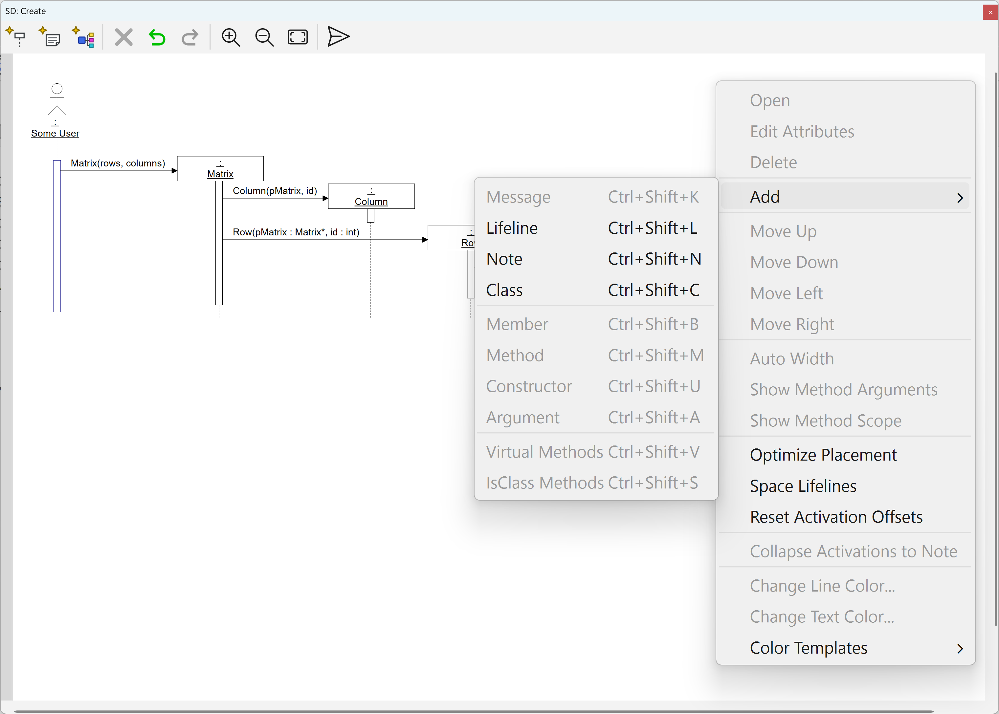

## Canvas keys

| **Key** | **Action** |
|----------------------|------------------------------------------------|
| `Ctrl+Shift+L` / `Ctrl+Shift+N` | arm Add Lifeline / Add Note placement |
| `Ctrl+Shift+C` | Add Class (dialog; lifeline auto-placed) |
| `Ctrl+↑` `Ctrl+↓` | move activation up/down among siblings |
| `Ctrl+←` `Ctrl+→` | move lifeline left/right |
| `←` `→` / `↑` `↓` | navigate between related shapes / along a lifeline |
| `Enter` | open the selected shape (as double-click) |
| `Del` / `Esc` / `Ctrl+A` | delete / cancel-or-clear / select all |

A power feature for documentation: **call traces**. Via the command interface (`add_call_trace`, chapter 16), ClassBuilder scans a method body, resolves the calls against the model, and generates a whole sequence diagram of the call tree automatically — a starting sketch to refine by hand.

# Reference: dialogs

Every dialog, what it edits, and the fields that need explanation. The screenshots show each dialog filled with Matrix-model content. (All dialogs end with OK/Cancel; changes are undoable model edits.)

Each dialog is described field by field. A **bold** label is a field you fill in or a button you press; a ***bold-italic*** label is a switch — a single checkbox, or a group of radio buttons named by the group, with its choices following in plain text (the grouping is the telling part, not each option label).

## Class

`Open` / `Edit Attributes` on a class — in the tree or on its diagram shape; `Add ▸ Class` (`Ctrl+Shift+C`) creates one and opens it.

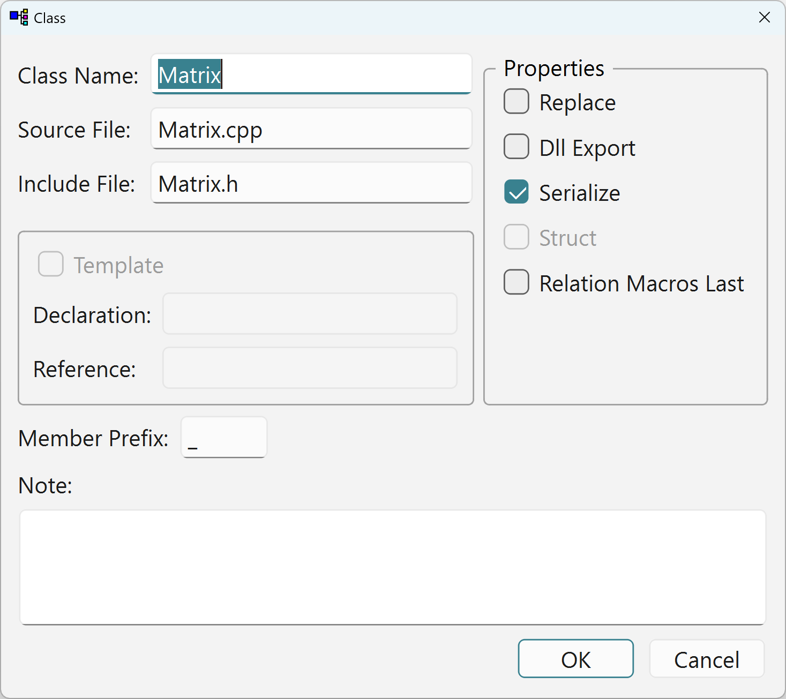

- **Name** — the class name.
- **Source File** / **Include File** — the output `.cpp` / `.h` paths.
- **Template** — makes the class a template; declaration `template<class T>` and reference `<T>`.
- **Member Prefix** — per-class override of the model default.
- ***Replace*** — generate the replace constructor (chapter 15).
- ***Dll Export*** — mark the class for DLL export.
- ***Serialize*** — enable serialization (chapter 13; locking rules below).
- ***Struct*** — emit `struct` instead of `class`.
- ***Relation Macros Last*** — move the relation-macro block to the end of the class declaration.
- **Note** — free descriptive text.

*Serialize locking:* the checkbox disables when switching would break the model — most importantly, a class with a Serialize-on subclass cannot turn Serialize off.

## External Class

`Open` / `Edit Attributes` on an extern-class node; `Add ▸ External Class` (`Ctrl+Shift+E`).

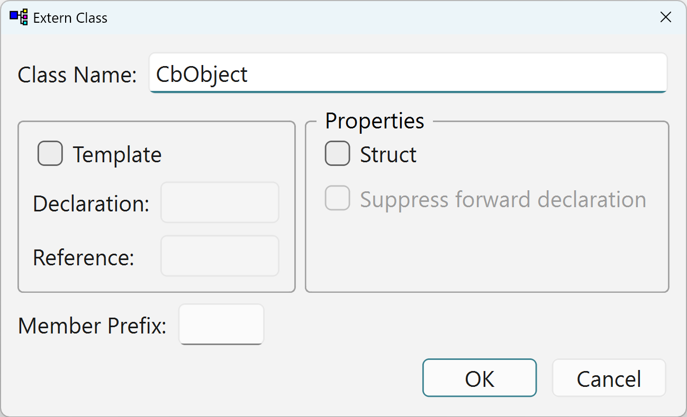

- **Name** — the external type's name.
- **Template declaration / reference** — for templated extern types.
- **Member prefix** — used when generated code calls its getters/setters.
- ***Struct*** — the type is a `struct`.
- ***Suppress forward declaration*** — for types that must not be forward-declared (e.g. typedefs).

## Member

`Open` / `Edit Attributes` on a member; `Add ▸ Member` (`Ctrl+Shift+B`) on a class.

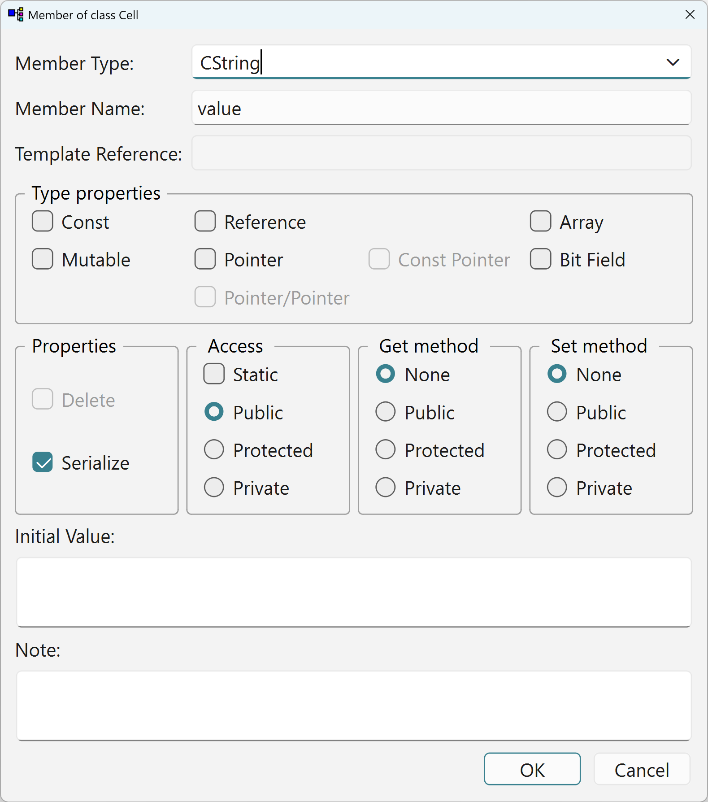

- **Type** — searchable combo of every type in the model.
- **name** — the bare name (the class's member prefix is added for you).
- **template reference** — the `<...>` arguments when the type is a template.
- ***Type shape*** — const, mutable, reference, pointer, pointer/pointer, const pointer, array `[size]`, bit field `[bits]`.
- ***Access*** — private / protected / public.
- ***Static*** — the member is class-wide (one shared instance).
- ***Serialize*** — include the member in the generated `Serialize` body (streamed with its version — chapter 13).
- ***Delete*** — emit the member as `= delete`.
- ***Get method*** / ***Set method*** — none / public / protected / private: generate a getter and/or setter at that access (see below).
- **Initial Value** — the constructor-initializer expression for the member.
- **Note** — free descriptive text.

**Generated getters and setters.** Choosing an access level (instead of *None*) generates `GetX()` (inline, `const`, returns the member) and/or `SetX(value)` with that access; the static flag follows the member, and both stay in sync when the member is renamed or retyped. One important special case: **if the member is the key of a tree-implemented relation** (Value Tree / Unique Value Tree / AVL Tree), the generated setter also **repositions the object inside the tree** — changing a key must never be a plain assignment. See chapter 12.8 for the generated code.

## Method

`Edit Attributes` on a method (`Open` goes to the code editor once the method has a body); `Add ▸ Method` (`Ctrl+Shift+M`) on a class.

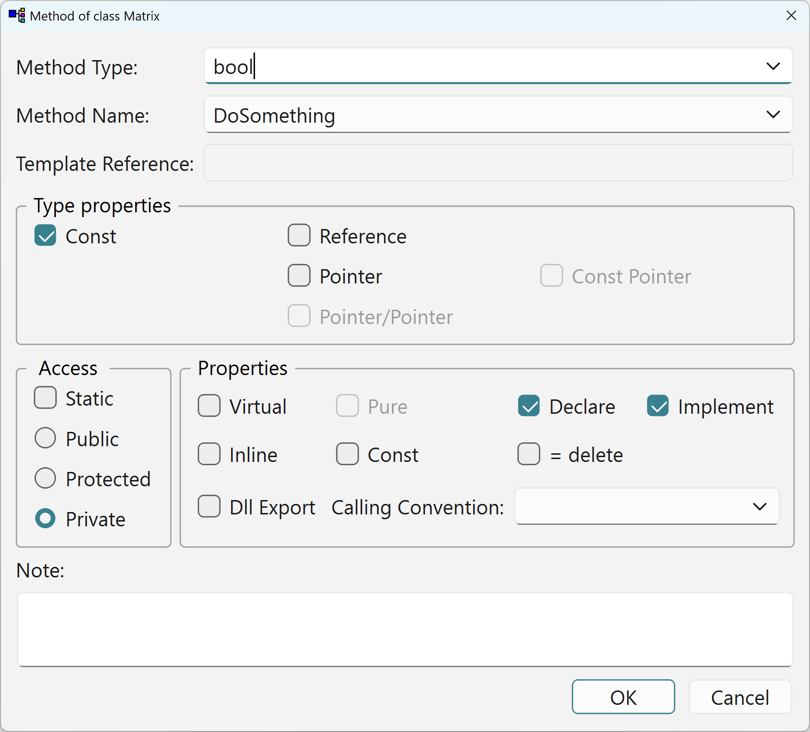

- **Return type** — the return type and shape.
- **name** — combo that remembers names used elsewhere (pick `Serialize` and the tool knows the convention).
- ***Access*** — private / protected / public.
- ***Static*** — a class-wide method.
- ***Virtual*** — a virtual method.
- ***Pure*** — pure virtual (`= 0`).
- ***Declare*** / ***Implement*** — whether to emit the declaration and/or an implementation body (declare-only for hand-implemented specials).
- ***Inline*** — an inline method.
- ***Const*** — a `const` method.
- ***= delete*** — emit the method as `= delete`.
- ***Dll Export*** — mark for DLL export.
- **Calling Convention** — `__cdecl`, `__stdcall`, … or free text.
- **Note** — emitted as the `@NOTE` comment above the method.

*Renaming a method* does not stop at the declaration: ClassBuilder scans all stored method bodies for occurrences of the old name and opens the **occurrences dialog** — every hit listed with its class/method location; select which to rename, and view any hit's code directly from the dialog before deciding. This makes model-wide renames safe without a text editor.

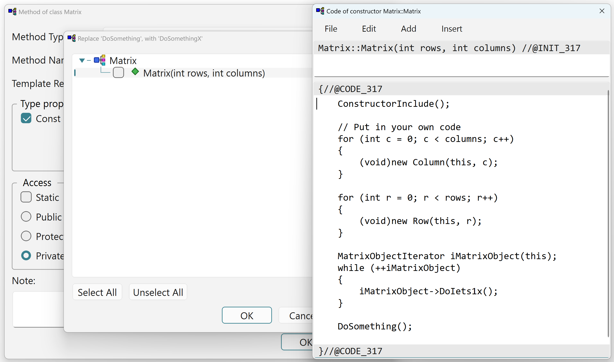

## Constructor / Destructor

`Edit Attributes` on the constructor / destructor node; `Add ▸ Constructor` (`Ctrl+Shift+U`) on a class.

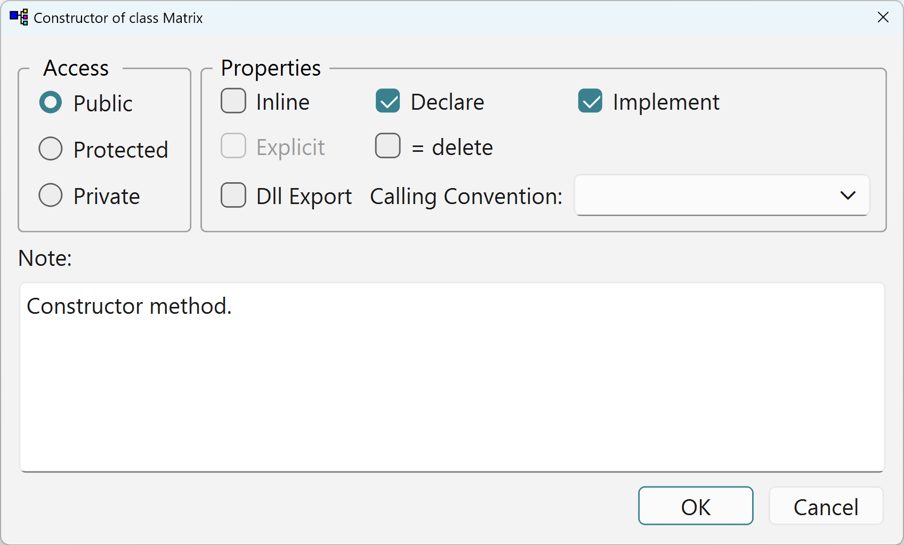

Constructor fields:

- ***Access*** — private / protected / public.
- ***Inline*** / ***Explicit*** / ***Declare*** / ***Implement*** / ***= delete*** / ***Dll Export*** — the usual method switches.
- **Calling Convention** — as for methods.

Plus the derived-arguments behaviour of chapter 4.5: the derived argument list and initializer list **re-derive automatically** when the class structure changes — adding/removing a member or changing a base updates the constructor's arguments and its `_x(value)` initializer entries (from each member's *Initial Value*). If you edit an initializer by hand in the constructor dialog, your text wins until the next structural change re-derives that entry.

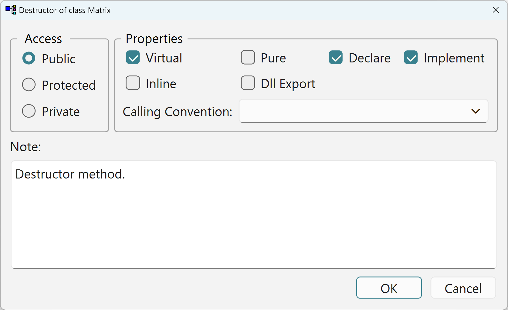

Destructor: the same switches minus ***Explicit***, plus ***Virtual*** / ***Pure***.

## Exception Specification

Per method: context menu ▸ *Edit Exception Specification*.

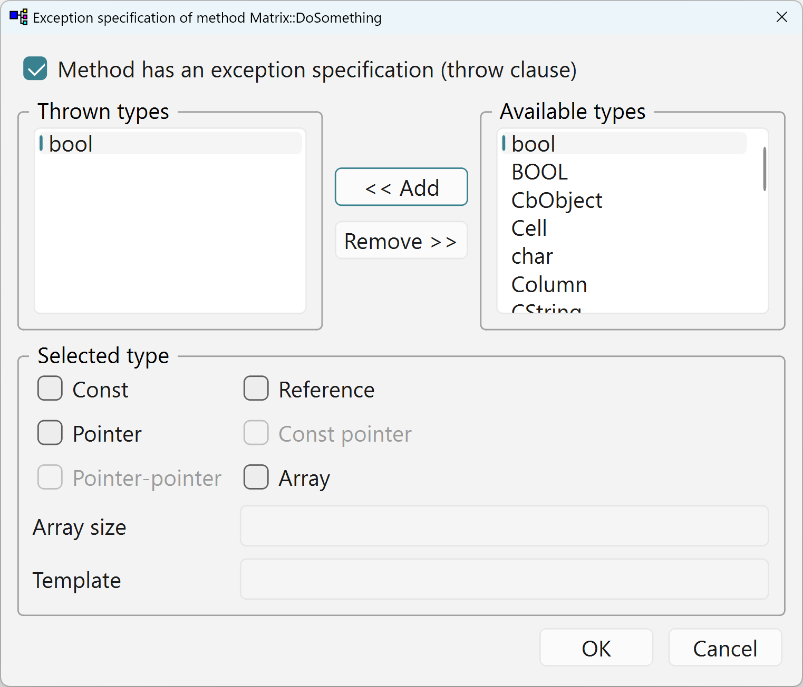

A master checkbox — ***Method has an exception specification (throw clause)*** — and a two-list builder: pick types from the model (with the usual type-shape modifiers: const, reference, pointer, const pointer, pointer-pointer, array size, template reference) and **Add** / **Remove** them to compose the emitted `throw(...)` clause.

## Argument

`Open` / `Edit Attributes` on an argument; `Add ▸ Argument` (`Ctrl+Shift+A`) on a method.

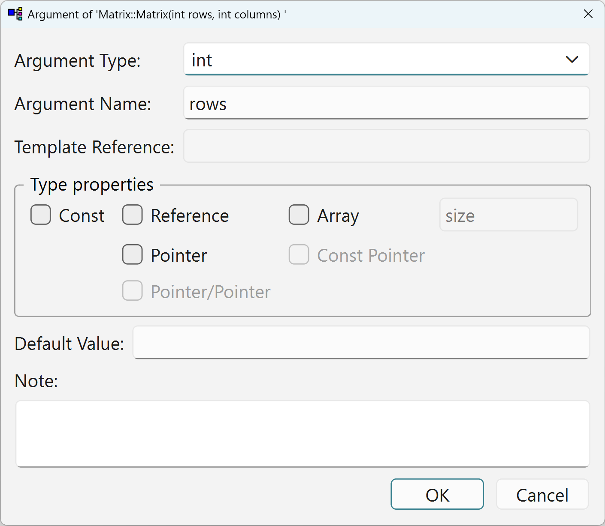

- **Type** — the argument's type and shape (const / ref / pointer / array).
- **name** — the argument name.
- **Default Value** — the default expression.
- **Note** — free text.

Reorder arguments by drag in the tree.

## Inheritance

`Open` / `Edit Attributes` on an inheritance node; `Add ▸ Inheritance` (`Ctrl+Shift+I`) on a class.

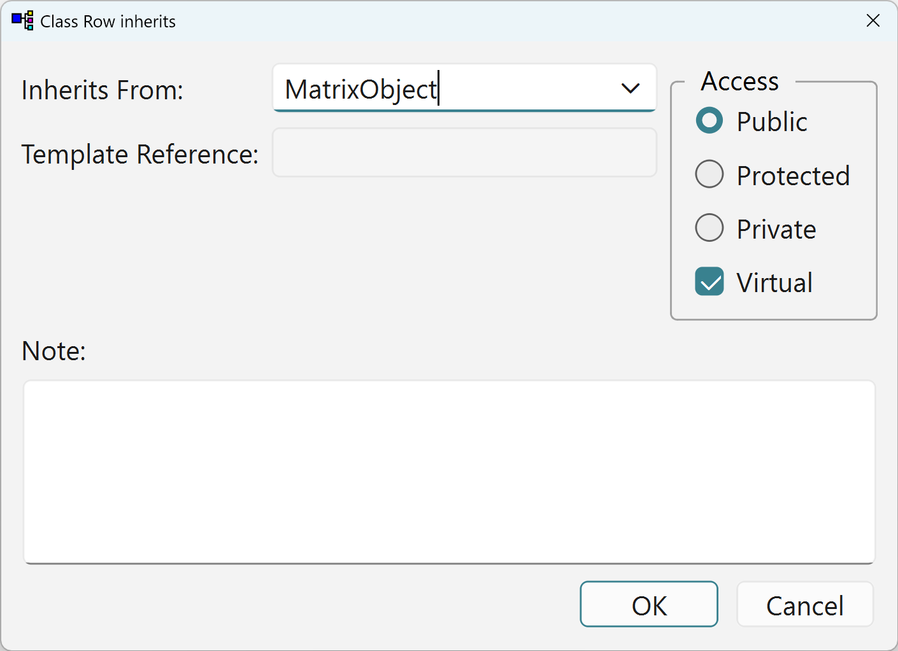

- **Base class** — combo of Classes + Extern Classes.
- ***Access*** — public / protected / private.
- ***Virtual*** — virtual inheritance.
- **Template reference** — inherit a specialization, e.g. `Base<int>`.
- **Note** — free text.

The **Base Classes / Derived Classes** context-menu items open read-only browser dialogs showing the inheritance hierarchy up- or downward from the clicked class.

| 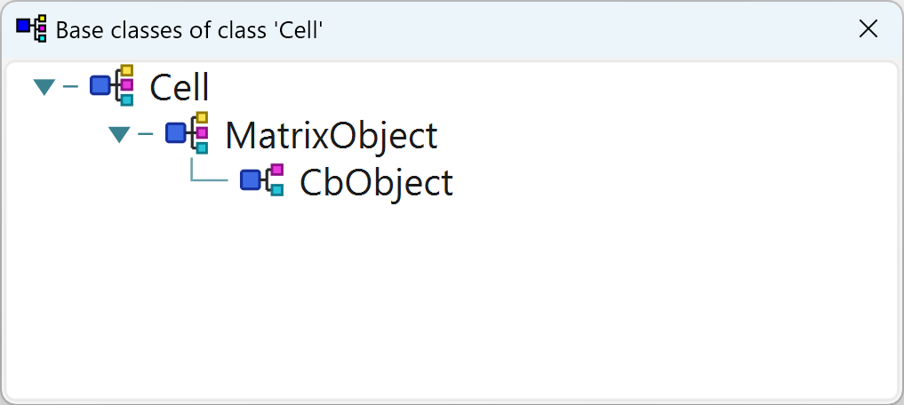 | 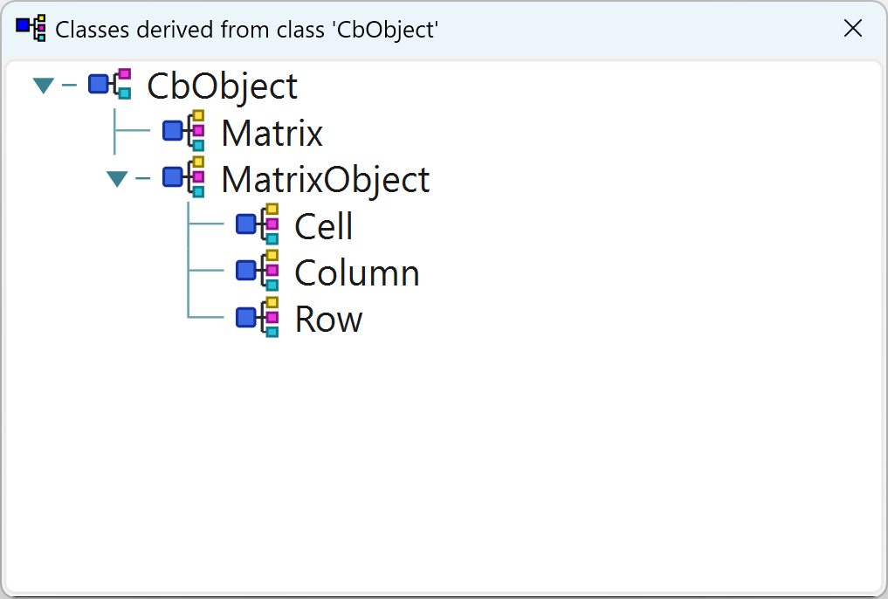 |
|------|------|

*Left: the Base Classes browser — everything the class inherits from. Right: the more telling Derived Classes browser — everything that inherits from it.*

## Relation

`Open` / `Edit Attributes` on a relation node; `Add ▸ Relation` (`Ctrl+Shift+R`) on a class, or **R**+drag between two classes on a diagram.

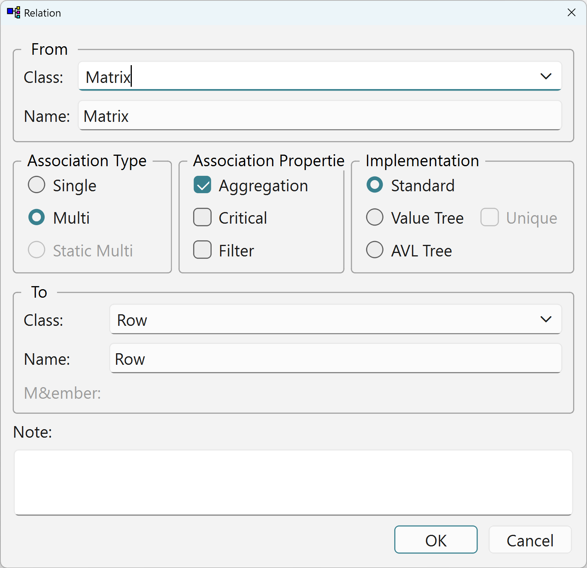

Chapter 12 is the background; the dialog fields:

- **From / To** — the two classes and their role names (the names appear in all generated identifiers: `GetFirstCell`, `AddCellLast`, `CellIterator`, …).
- ***Association Type*** — single (one pointer), multi (a list), static multi (one *shared* container across all instances of the from-class).
- ***Aggregation*** — owned; deleting the parent cascades to the children.
- ***Critical*** — thread-safe; every operation locks (chapter 12.9).
- ***Filter*** — iterators gain a predicate variant.
- ***Implementation*** *(multi only)* — standard (doubly-linked intrusive list), value tree (bit-indexed on an integer-like key; fastest find, unordered), AVL tree (balanced, ordered iteration; the key type must support `<`, `<=`, `>`, `>=`, `==` — ints and `CbString` qualify).
- ***Unique*** — the no-duplicates variant of the value tree.
- **Member** — the key member for the tree variants; its generated setter becomes tree-aware (chapter 12.8).

## Find Method (on a relation)

Created on a **multi relation**: context menu of the relation node.

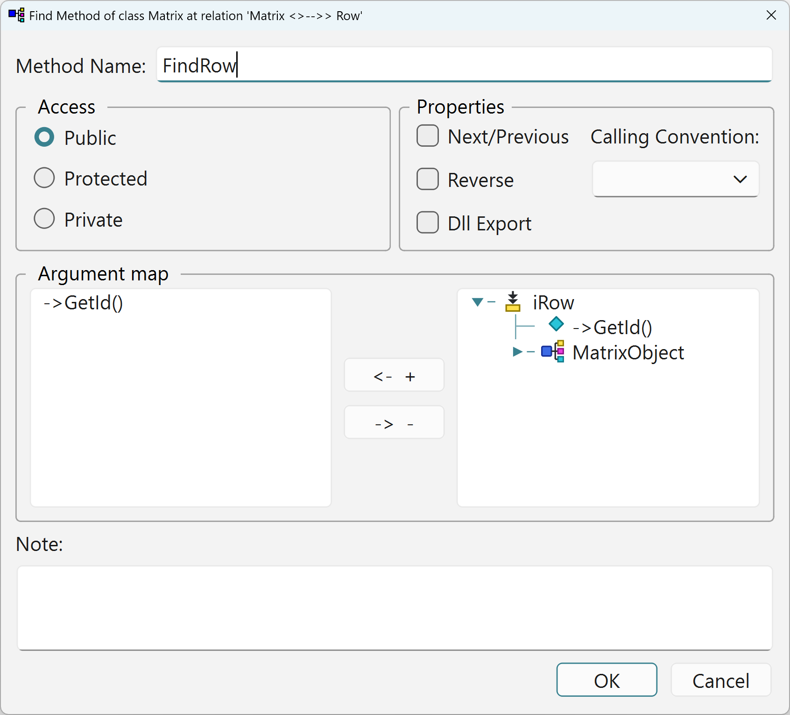

The dialog offers a tree of everything reachable from the iterated object — its members, and members reached by *navigating* further relations — from which you pick the value(s) to compare; each pick becomes an argument of the generated method. The **Name** defaults to `Find<ToName>` (editable), plus ***Reverse*** iteration and a ***Continue-after*** argument (find the *next* match, for iterating all matches). On a list relation the code body is the compare loop of chapter 4.6; on a value-tree/AVL relation whose key matches the argument, the fast tree lookup is generated instead — callers are identical either way.

## Dependency

On a class diagram: `Add ▸ Dependency` (`Ctrl+Shift+D`) or **D**+drag from client to supplier; `Open` on a dependency connection.

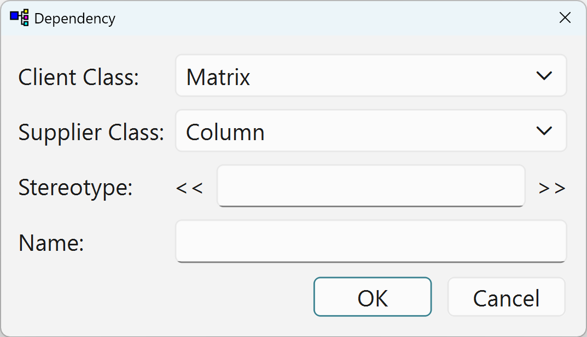

- **Client Class** — the user (client) side.
- **Supplier Class** — the used (supplier) side.
- **Stereotype** — text drawn between `<< >>` guillemets on the dashed arrow.
- **Name** — the dependency name.

Like Relation (Diagram Only), a dependency is drawing-only: nothing enters the model's code generation.

## Relation (Diagram Only)

On a class diagram: `Add ▸ Relation (Diagram Only)` (`Ctrl+Shift+O`) or **O**+drag; `Open` on the connection.

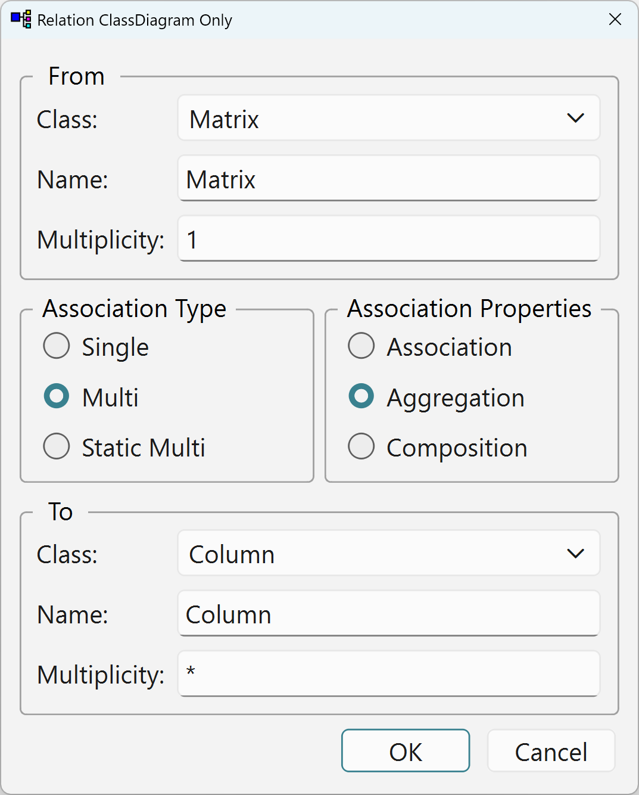

The drawing-only counterpart of the Relation dialog:

- **Class** (both ends) — the two classes.
- **Name** (both ends) — the role names.
- **Multiplicity** (both ends) — free multiplicity text.
- ***Kind*** — single / multi / static multi.
- ***Notation*** — association / aggregation / composition (the UML decoration drawn).

Nothing enters the model and nothing is generated — pure documentation, and notation-wise *richer* than modeled relations (e.g. Composition).

## Type

`Open` / `Edit Attributes` on a type under *Other Types*; `Add ▸ Type` (`Ctrl+Shift+Y`).

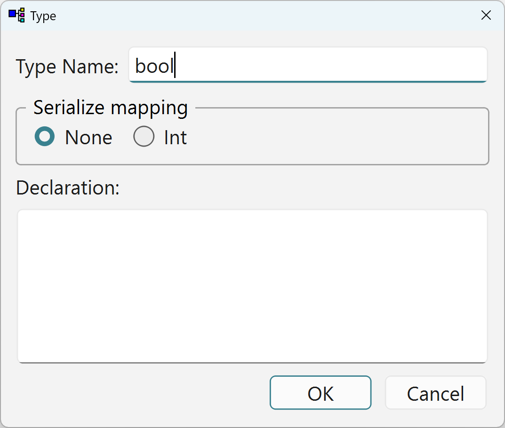

- **Name** — the type's name.
- ***Serialize mapping*** — none or int: how the unknown type is streamed.
- **Declaration** — a text block: the actual `typedef` / `enum` / `struct` C++ text emitted into the master include.

With Serialize on, a serialized member of such a type must be streamable: map the type to **Int** when it converts to an integer. When it cannot (mapping **None**), supply the two stream operators for the type yourself — for example in `StdAfx.h` or a user section:

```cpp
CbArchive& operator <<(CbArchive& archive, const TypeName& typeName);
CbArchive& operator >>(CbArchive& archive, TypeName& typeName);
```

## Group / Meta Group

`Add ▸ Group` (`Ctrl+Shift+G`) creates the group where the selection points: on a **class**, an in-class folder that groups its members and methods; on the **model node** (or inside a Meta Group), a **ClassGroup** that groups classes. `Add ▸ Meta Group` (`Ctrl+Shift+P`) always lands at the top level, as a **sibling next to the model node** — whatever is selected; it collects ClassGroups (the three levels of chapter 2.1). `Edit Attributes` on any group folder opens the dialog.

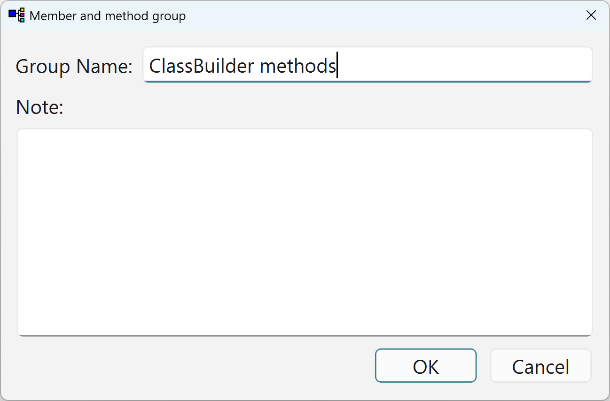

Name + note.

## Context — define and assign

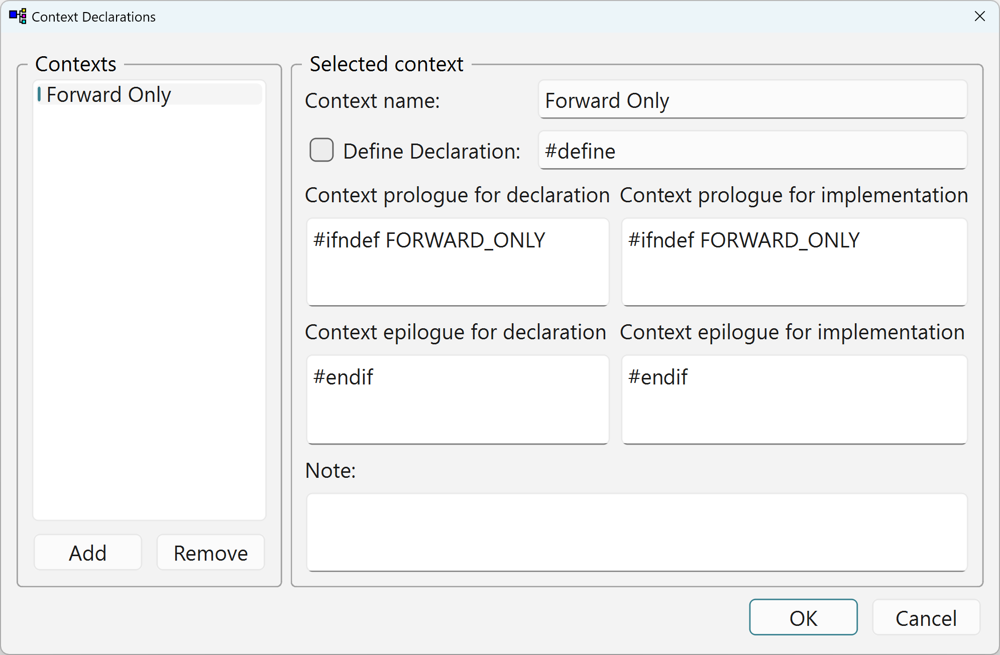

A **context** is a named wrapper of free-form text: for every element assigned to it, the text you define is emitted *before* and *after* the generated declaration (`.h`) and implementation (`.cpp`). Wrapping classes or methods in `#ifdef`/`#endif` to compile them in or out of a build is one common use — but any bracketing text works: `#pragma` push/pop pairs, compiler-specific attributes, warning suppressions. Two dialogs:

- **Edit Context** (on the model node) manages the **context declarations**: each has a name, the `#define` line to emit into the master include (with an enable/disable flag — the master include's "Context define declarations" section), and the exact start/end wrapper text used around declarations (`.h`) and implementations (`.cpp`).
- **Assign Context** (on a class or method) assigns declarations to that element: the left list shows contexts already assigned, the right list the available declarations; **Add** and **Remove** move between them.

Typical use: feature flags (`FEATURE_X`), platform sections, debug-only helpers, or pragma/warning brackets — modeled once, consistently emitted, instead of hand-maintained preprocessor text scattered through user regions.

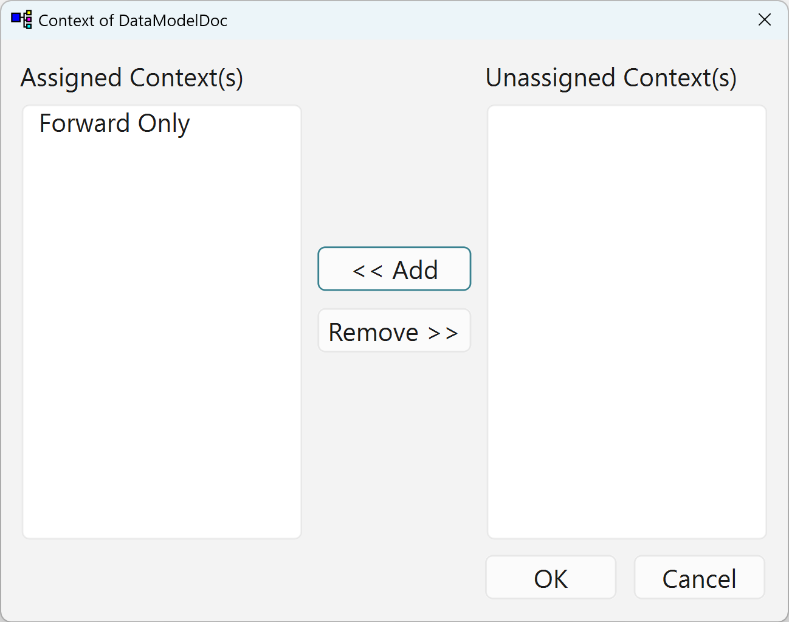

## Actor

`Open` / `Edit Attributes` on an actor under *Actors*; `Add ▸ Actor` (`Ctrl+Shift+T`).

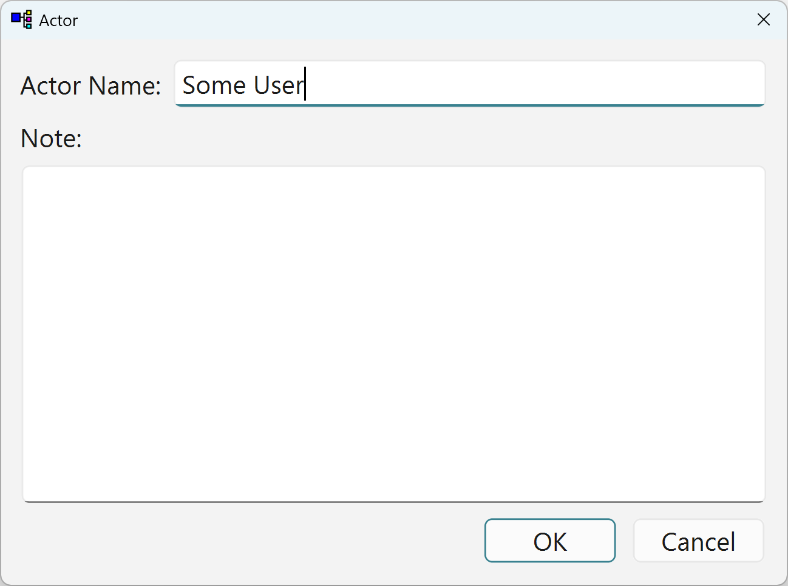

Name + note; actors appear under `Actors` and go on sequence diagrams as stick figures.

## Class Diagram

`Edit Attributes` on the diagram node in the tree; `Add ▸ Class Diagram` on the model node creates one and opens this dialog first.

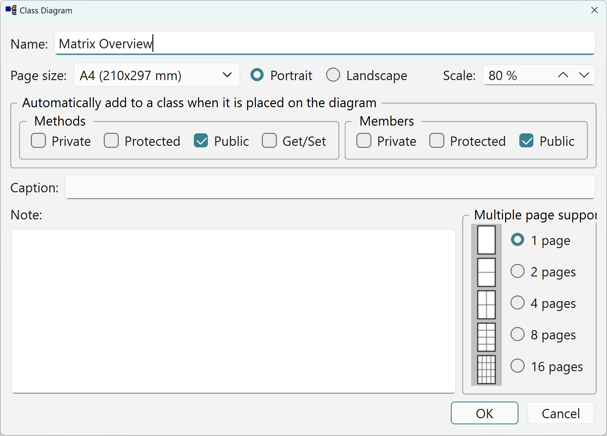

- **Name** — the diagram name.
- **Page size / orientation / scale** — the drawing page setup.
- **Multi-page layout** — 1–16 pages.
- **Caption** — a caption drawn on the diagram.
- **Note** — free text.
- ***Auto-add*** matrix — which member/method access levels are shown automatically when a class is placed on this diagram (private / protected / public members and methods, plus Get/Set methods).

## Sequence Diagram

`Edit Attributes` on the diagram node; `Add ▸ Sequence Diagram` creates one and opens this dialog first.


- **Name** — the diagram name.
- **Page setup** — as above.
- ***Message Numbering*** — none, `1`, `a`, `A`, `1.1.1`, `a.a.a`, `A.A.A`.
- ***Message Name*** — argument types, argument names, scope (what each message label shows).

Per-message overrides exist on each signal's own dialog.

## Select Classes

From the class diagram's context menu.

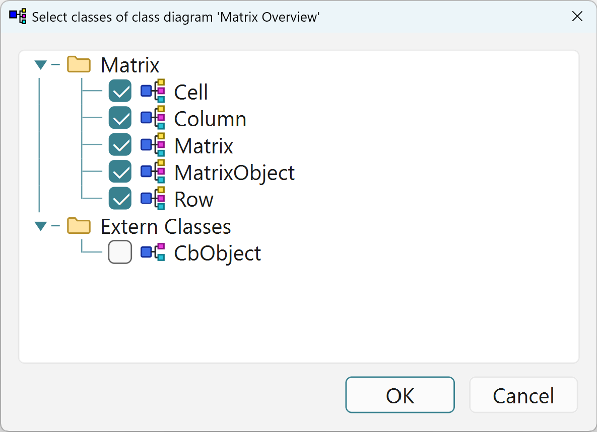

A checkbox list of **every class in the model**: tick to place a class on this diagram, untick to remove its shape. The bulk way to (re)compose a diagram — newly ticked classes are placed on free grid positions (run `Optimize Placement` afterwards).

## Select Members & Methods

Controls **which individual members and methods are visible** on a class shape. (The diagram's auto-add flags only seed the initial set when a class is placed — they put no limit on what you pick here.) The context-menu action comes in two tastes, depending on the selection:

- **One class selected**: a per-class picker, titled with the class name — two checkbox lists, the class's members and methods, each with Select All / Unselect All; ticked items are shown on *this* shape. (`Open` / `Edit Attributes` on a class shape is something else: it opens the ordinary Class dialog of 9.1, exactly as in the tree.)
- **Nothing selected**: the **diagram-wide picker** — a checkbox tree of every class shape with its members and methods beneath; OK/**Apply** commit, Cancel rolls everything back.

The same class can show different features on different diagrams.

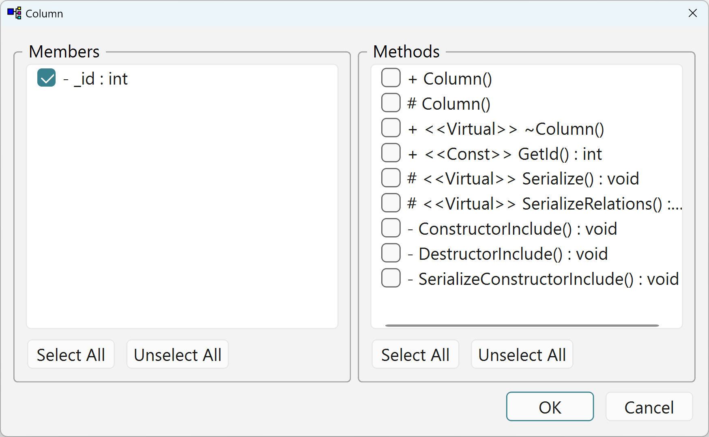

One class selected: the per-class picker, titled with the class name.

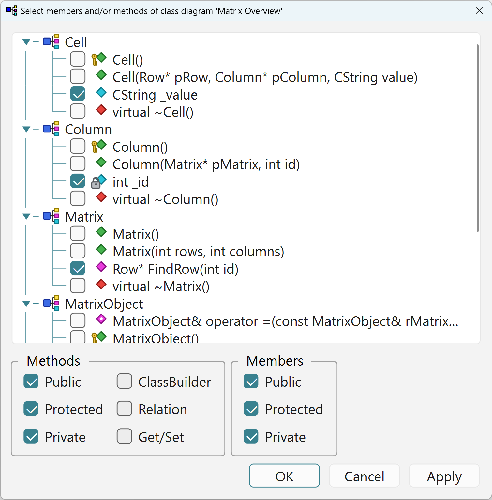

Nothing selected: the diagram-wide tree.

## Reorder Members & Methods

From the class-diagram context menu, on a selected class.

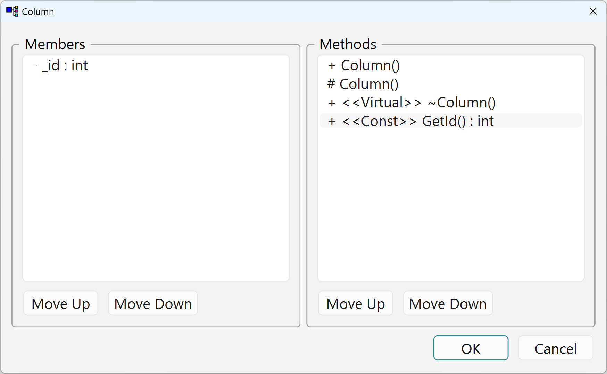

Reorders how a class's members and methods are laid out **in this diagram's box**, with the **Move Up / Move Down** buttons. It is the button-driven variant of the direct row-drag inside the class shape (chapter 7), convenient for long lists. Like that drag, the order is **local to the diagram** — each diagram keeps its own arrangement (and may show only a subset), so it does **not** change the declaration order in the generated file.

## Signal (message)

`Open` on a message in a sequence diagram — it also opens on every message drag-creation (chapter 8.1).

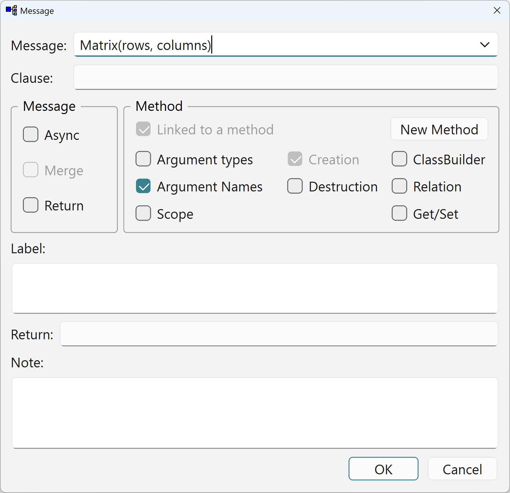

- **Name** — the displayed call.
- **Label / guard** — the `[...]` clause (the `*` clause conventionally means "called in a loop").
- **Return text** — the return label.
- ***Show return arrow*** — draw the return arrow.
- ***Async*** — an asynchronous message.
- ***Argument / scope display*** — per-message override of what the label shows.
- **Note** — free text.

## LifeLine / Note dialogs

`Open` on a lifeline head, or on a note (either diagram kind).

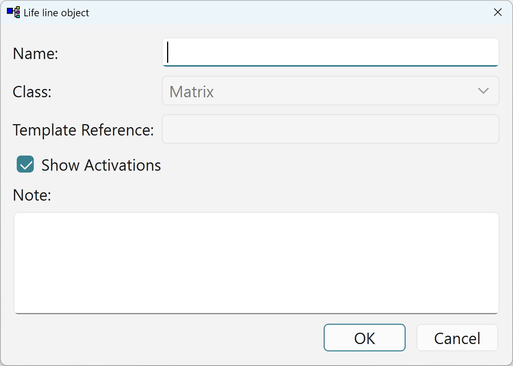

LifeLine:

- **Class / actor** — the class or actor the lifeline represents.
- ***Auto-width*** — size the head to its label.

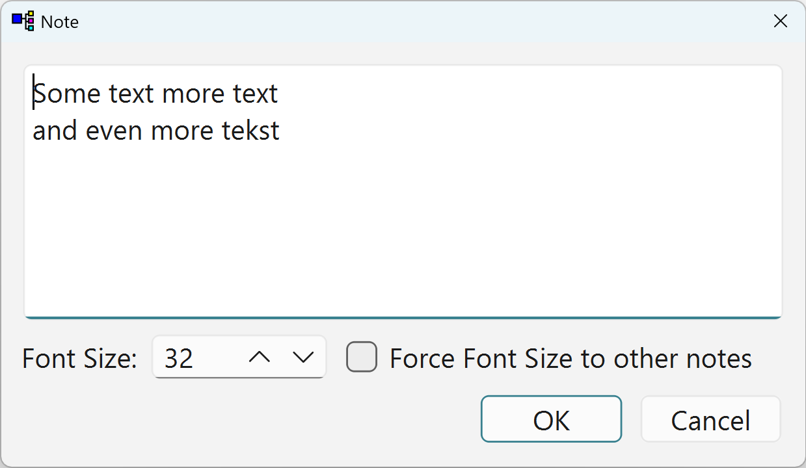

Note (both diagram kinds):

- **Text** — the note text.
- **Font height** — the note's text size.
- ***Force to all*** — apply the size to every note.

## Project Settings and the DataModel dialog

Two related dialogs share this ground: **Edit Attributes on the model node** opens the "DataModel" dialog (the model's structural properties), while **Project ▸ Settings...** opens "Project Settings" (working preferences: the **Undo stack** depth, **Additional Allowed** identifier characters, **Comment Initial Code**, and the Method Name / Similar Lines lists). The fields are described below, per dialog.

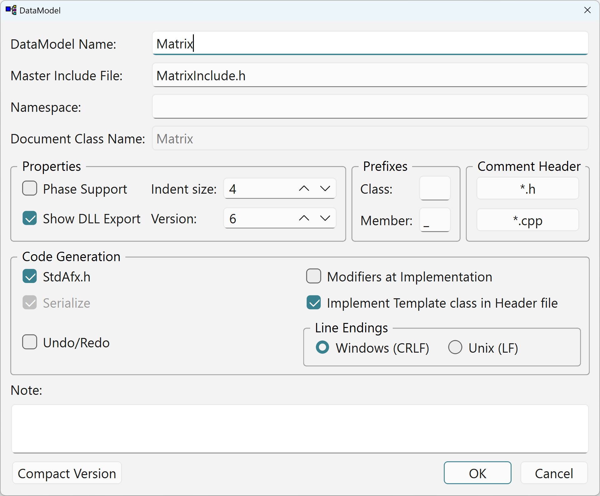

- **Model name** — the model's name.
- **Master Include File** — the master include path.
- **Namespace** — wraps all generated code.
- **Document Class Name** — the serialization document class.
- **Indent size** — generated-code indentation.
- **Class name prefix** / **Member prefix** — the model-wide default prefixes.
- **Version** — the model schema version (chapter 13); the **Compact Version** button renumbers to the smallest equivalent scheme.
- **Comment-header templates** — `.h` / `.cpp`; two buttons each open an editor for the template applied to the header comment of every generated file of that kind (see below).
- ***Phase Support*** — enable the phase glyphs and workflow.
- ***Show DLL Export*** — surface the DLL-export options.
- ***Code Generation*** — StdAfx.h include, Serialize, ***Undo/Redo*** (chapter 14; enable-once), Modifiers at Implementation, Implement Template class in Header file, and line endings (CRLF / LF).

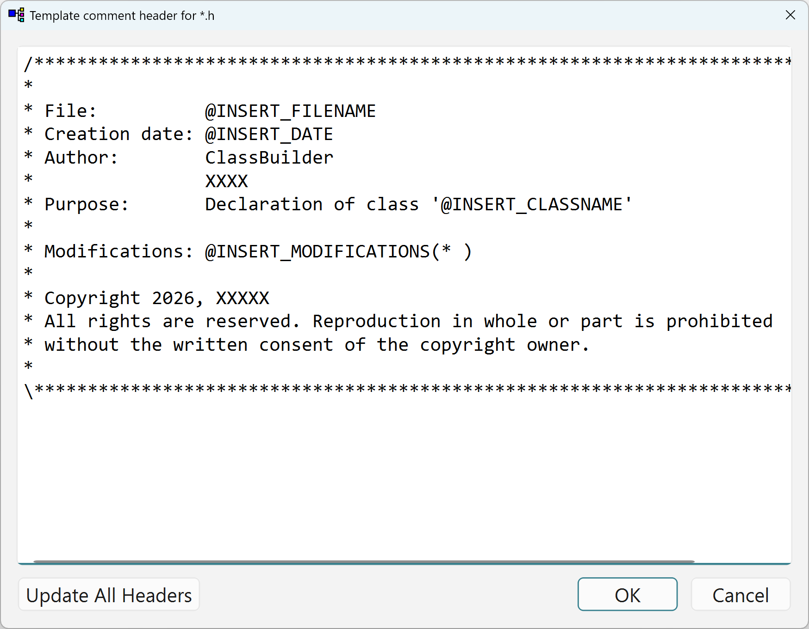

The comment-header editor — the same editor serves the `.h` and the `.cpp` template. The text is free-form; the placeholders (file name, date, author, purpose) are filled in per generated file, and the `@INSERT_MODIFICATIONS(* )` marker is where each Write Source stamps its change-log line (the *Author & Note* text of the Save Source dialog).

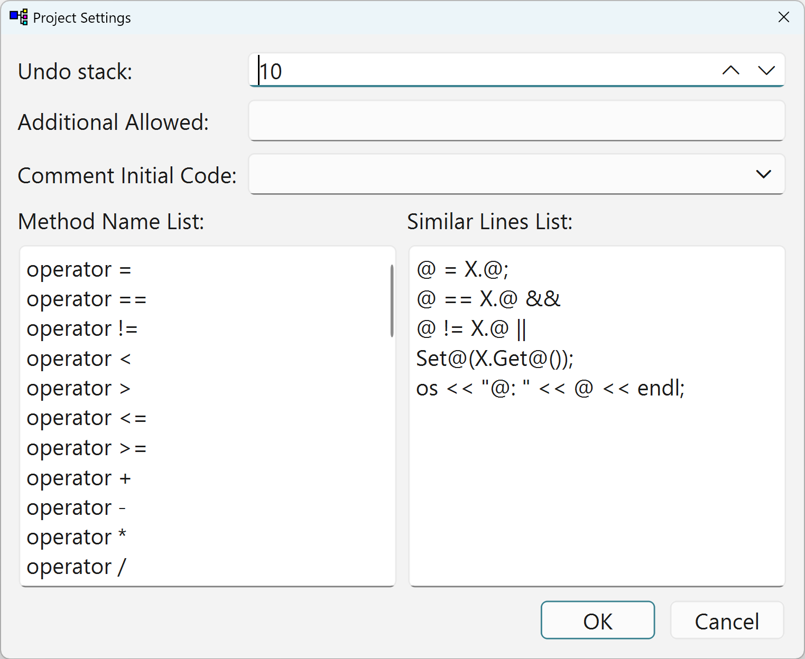

- **Undo stack** — depth, default 10 steps; raise it for deeper undo history.
- **Additional Allowed** — extra identifier characters.
- **Comment Initial Code** — the TODO line seeded into new method bodies.
- **Method Name List** / **Similar Lines List** — name suggestions and the similar-lines tool's pattern list.

## Add Serialization to project

`Project ▸ Add Serialize...` — on a model that was created without Serialize.

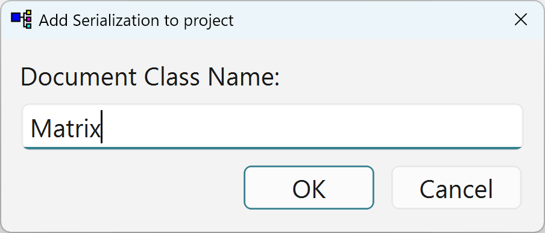

Adds the full serialization scaffolding to an existing model that was created without it: you supply the **Document Class Name**, and the wizard creates the `CbObject` extern, the document class, the document-object root, their relation, and the `SerializeMembersOnly` machinery (chapter 13.1). One-way — once a model has Serialize, it keeps it.

## Find

`Ctrl+F` in a tree view (toolbar: the magnifier).

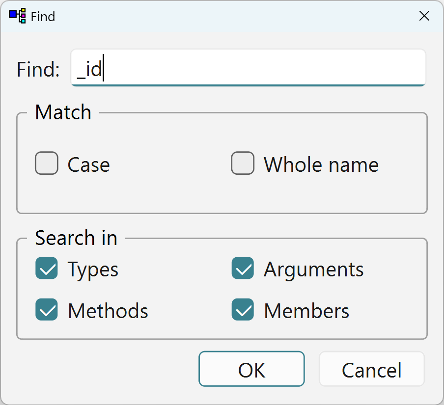

- **Search text** — the text to find.
- ***Match case*** / ***Whole name*** — matching options.
- ***Element kinds*** — Types / Arguments / Methods / Members to search.

`F3` repeats.

## Read Source

`File ▸ Read Source...` (toolbar: **Read Source**).

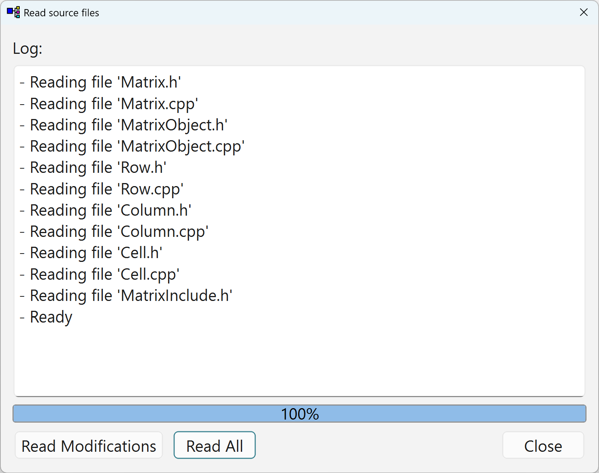

Non-modal progress dialog for source read-back: log pane, progress bar, **Read Modifications** (changed files only) vs **Read All**.

## Save Source

`File ▸ Save Source...` (toolbar: **Write Source**).

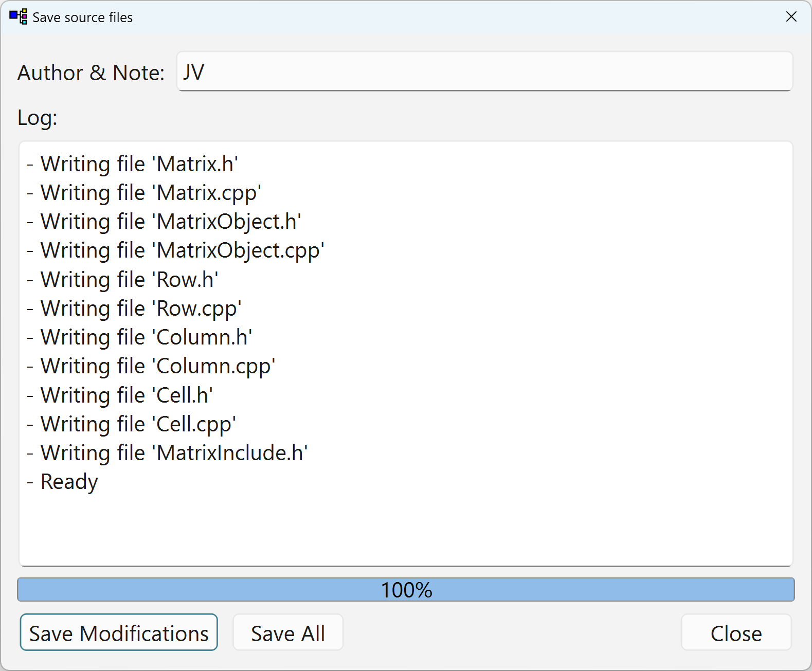

The generation twin of Read Source: **Save Modifications** (only classes changed since the last write) vs **Save All**, a log pane — and the **Author & Note** field, whose text is stamped into each rewritten file's *Modifications* change log (the `@INSERT_MODIFICATIONS` block in the header comment). That is where the author initials next to each change line in generated headers come from.

## Virtual Methods / IsClass Methods / Wrap Member Methods


Three generators of one family: `Add ▸ Virtual Methods` (`Ctrl+Shift+V`) and `Add ▸ IsClass Methods` (`Ctrl+Shift+S`) in the tree, Wrap Member Methods from a member's context menu. **Virtual Methods** exists in two situations:

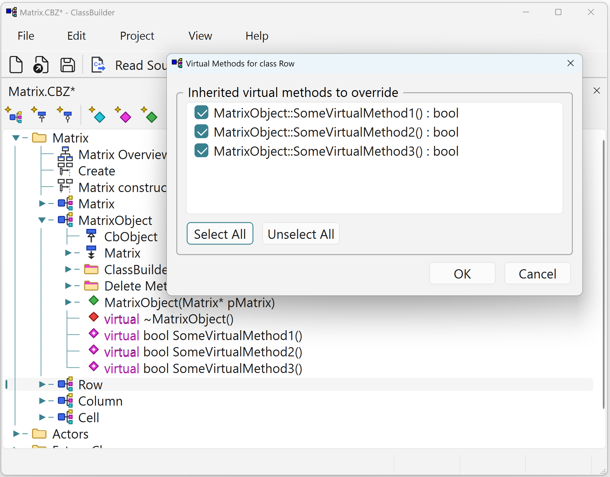

On a **class**: the inherited virtuals of all base classes — tick them and overrides with matching signatures land on the class in one click.

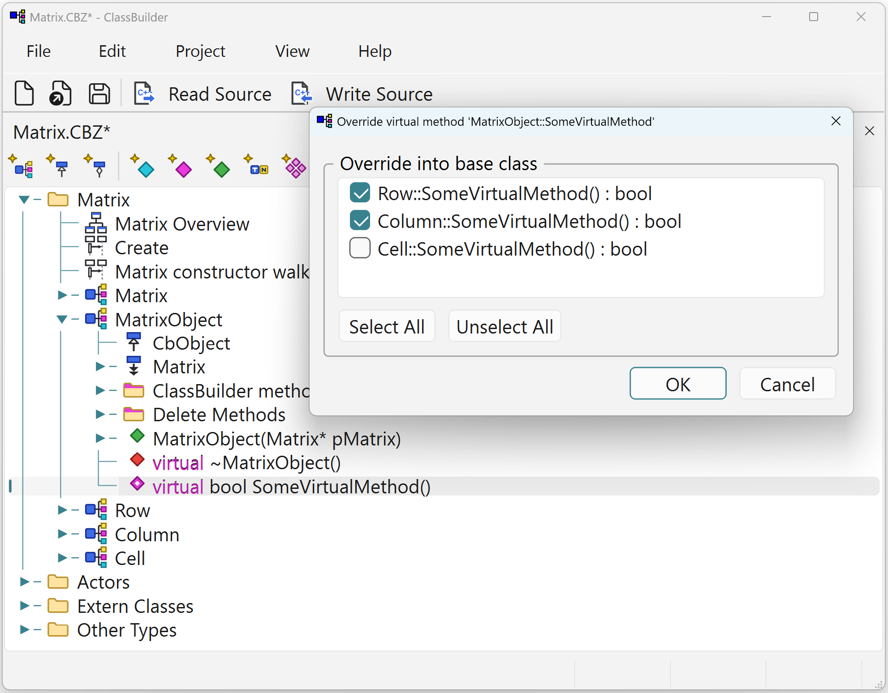

On a **virtual method** of a base class it works top-down: the derived classes that do not override it yet — tick them and each receives the override with an empty body to fill in.

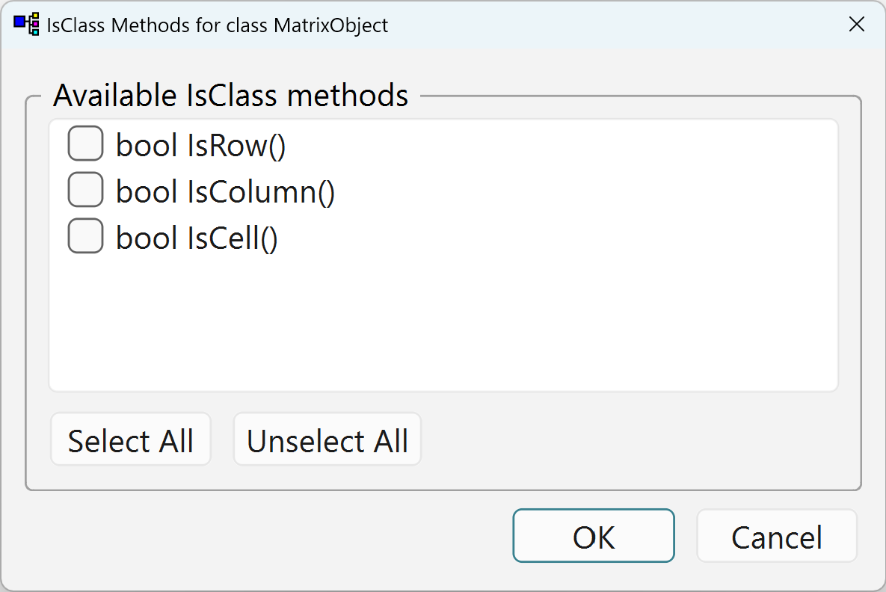

**IsClass Methods** adds `IsRow()`-style type predicates to a base class for each selected subclass (implemented via `dynamic_cast`, returning a boolean truth value). With **Filter** enabled on a multi relation, these IsX predicates are exactly what the filter iterator takes (chapter 12.6).

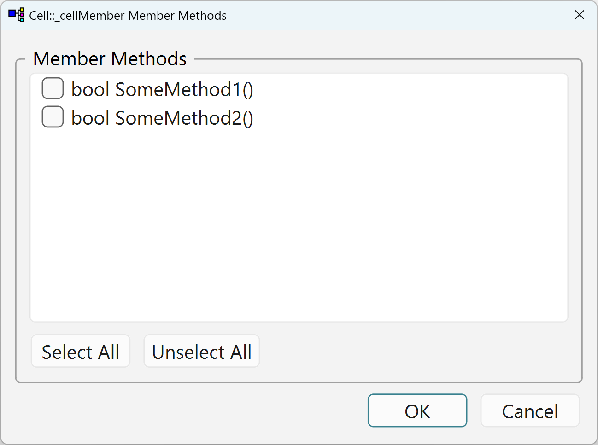

**Wrap Member Methods**, on a member whose type is a class: pick methods of the member's class and forwarding wrappers are generated on the containing class — the classic "expose the embedded object's interface" chore.

## User Sections / Code dialogs

The six per-class user sections and the method-body editor both embed the code editor — see the next chapter.

The user-section editor pins the `//@START_USER`/`//@END_USER` marker bands above and below your text.

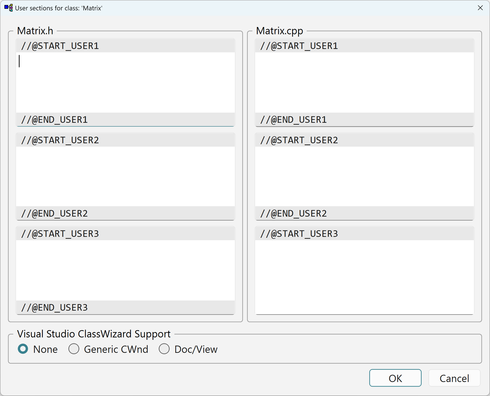

`Edit User Sections` shows all six regions of the class — three in the `.h`, three in the `.cpp` — in one dialog.

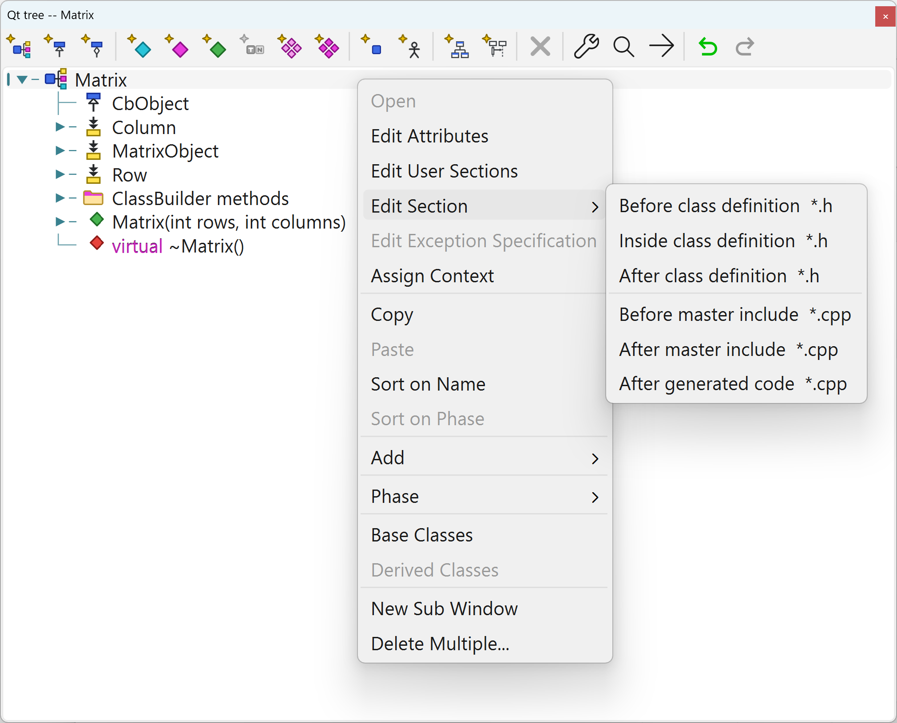

The `Edit Section ▸` submenu jumps straight to one section:

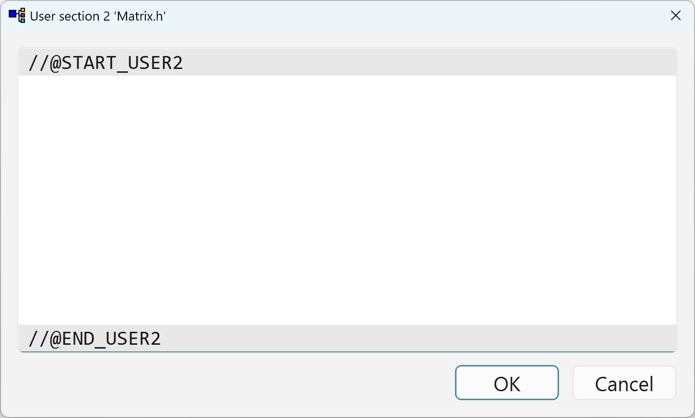

One section in its own editor.


The method-body editor edits exactly the text between the `@CODE` markers.

The constructor's two-pane variant — initializer list above the body, divided by a splitter — has its own section in the next chapter.

## Code-editing helper wizards

Launched **from the code editor** (method/constructor code dialogs, `Insert` menu), these insert correct code instead of making you type it. There are four, each with its own dialog: the **Iterator Wizard**, the **Type Variable Wizard**, the **Variable→Method() Wizard** and **Similar Lines**.

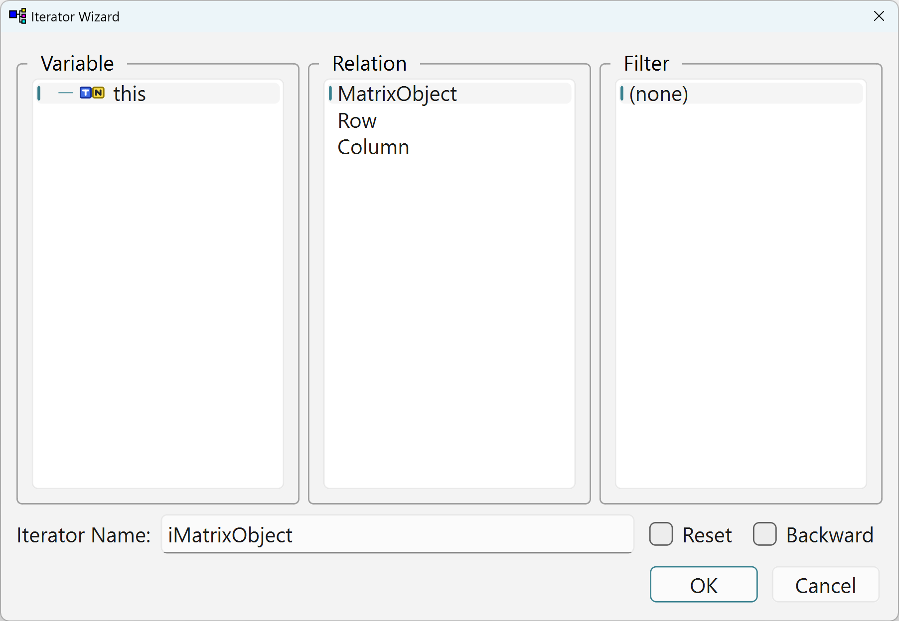

**Iterator Wizard** — pick a variable reachable in the current scope (a tree of candidates, derived from the arguments, members and the code so far), then one of its class's relations, optionally a filter predicate — and the correctly-typed iterator loop (`X::YIterator i(...); while (++i) { }`) is inserted at the caret, indentation matched. Two checkboxes tune the loop: **Backward** walks the relation in reverse — the loop advances with `while (--i)` (last to first) instead of `while (++i)`. **Reset** re-uses an iterator that already exists in the body: instead of declaring a new one, the wizard inserts `i.Reset();` followed by the loop, rewinding the existing iterator for another pass — when the chosen name is already in use, pick a fresh name or tick *Reset*.

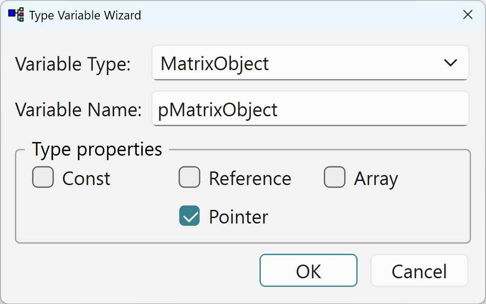

**Type Variable Wizard** — declare a local variable: pick the **type** (with const/reference/array/pointer modifiers) and **name**; the declaration is inserted.

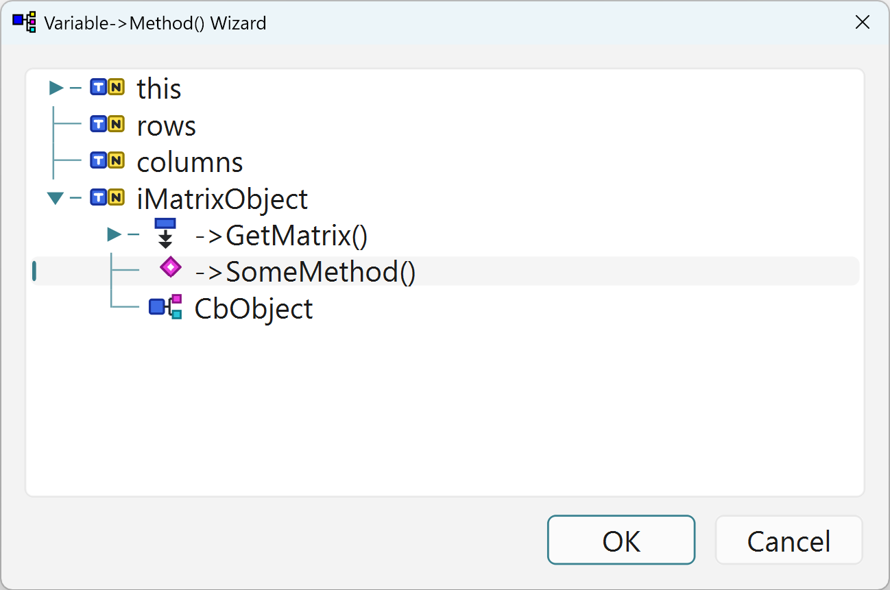

**Variable→Method() Wizard** — pick a reachable variable, then one of the methods of its class; the call expression is inserted through that variable.

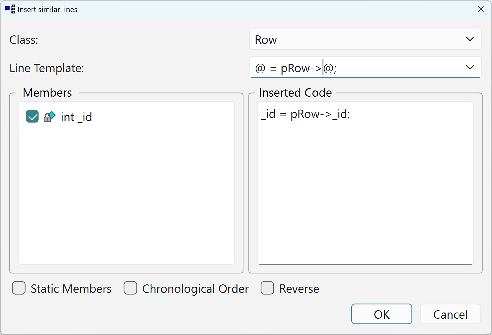

**Similar Lines** — works against the *Similar Lines List* patterns from Project Settings: shows where bodies contain matching recurring lines, for reviewing/harmonizing repeated hand-written idioms.


# Reference: the code editor

Method bodies, constructor/destructor bodies and the user sections are edited in ClassBuilder's built-in code editor (a fixed-pitch C++ editor; Consolas 11 pt on Windows). It is a *model-aware* editor: syntax colours, the rename command and the code completion all draw on the live data model, not on text heuristics.

## Editing behavior

- **Enter** inserts a newline with a *predicted* indent: after a line ending in `{` it indents one level deeper; after `}` it returns to the closing brace's level; after `;` it keeps the statement level; after `:` (labels, initializer lists) it indents one level.
- Typing **`{`** on an otherwise-blank line re-indents it to the construct it belongs to — the previous non-blank line's level (the `if`/`for`/function header, Allman style); only a block nested directly under another `{` keeps the deeper predicted indent. Typing **`}`** on an otherwise-blank line re-indents it one level out from the block body, aligning it with its opening brace.
- **Tab** indents — with a selection, all selected lines shift one indent level; without, spaces are inserted to the next indent stop. **Shift+Tab** un-indents. Indentation is spaces (the width follows the model's *Indent size* setting, default 4).
- **Move lines up / down** (`Alt+Up` / `Alt+Down`, also on the `Edit` menu) moves the selected lines — or the caret's line — as a block, one line per press, keeping the selection on the moved block so repeated presses keep walking it. A selection ending at column 0 does not drag that last line along.
- **Reformat code** (`Ctrl+Shift+R`, `Edit` menu) re-indents the selection — or, without a selection, the whole text — with the same rules that drive typing: predictor indent for ordinary lines, `}` one level out, `{` per the Allman rule above, preprocessor lines to column 0. Lines inside block comments are left untouched. One undo step.
- **Auto-close pairs.** Typing `(`, `[`, `{`, `"` or `'` inserts the matching closer with the caret between them; typing the closer where it already sits steps over it; `Backspace` on an empty pair deletes both halves. With text selected, the opener *surrounds* the selection. Typing `{` then **Enter** expands to an indented three-line block, caret on the middle line. (These stay out of the way — a pair is not inserted when the caret is glued to a word, and a quote not right after a letter.) For brackets, stepping over and pair-deletion both respect the **line's bracket balance**: with no unmatched opener left of the caret a typed `)` really inserts (the closer under the caret is an outer construct's — the `if (`'s, say), and on an unbalanced line `Backspace` in `IsLast(|)` deletes only the opener, never an outer `if`'s closer.
- **Comments.** `Ctrl+/` toggles `//` on the selected lines (or the caret's line) — commenting, or uncommenting when every non-blank line already is; blank lines are left alone. `Ctrl+Shift+B` wraps the selection in a `/* ... */` block comment, or unwraps it when it already is one. Both on the `Edit` menu.
- **Font zoom.** `Ctrl++` / `Ctrl+-` step the editor font up and down; `Ctrl+0` resets; `Ctrl`+mouse-wheel zooms too — also on the editor's **View** menu.
- No line wrapping; long lines scroll.

## Syntax colours

The highlighter colours C++ — keywords (blue), built-in types (teal), strings (dark red), numbers (purple), preprocessor lines (grey), comments (green, including multi-line `/* */`) — and extends the same signals with what the **model** knows:

- **Model types** — every named type in the model (classes, extern classes, typedefs) *and* the relation-generated iterator types (`RowIterator`, both bare and as `Matrix::RowIterator`) — take the same teal as the built-in types: one consistent "known type" signal.
- **Arguments** of the edited method render *italic* — in the code, and in the signature strip above the editor. Renaming or adding an argument updates the italics immediately.

The caret's line carries a faint blue tint; when the caret touches a `{}`, `()` or `[]`, the brace and its match get a soft green box — see the constructor-editor figure below.

## The occurrence highlight and Rename (F2)

Put the caret in (or double-click) an identifier and every whole-identifier occurrence is highlighted soft yellow — *whole-identifier*, so `row` never lights up inside `rowCount`. The highlight deliberately shows the **full rename set**: it spans the body, the constructor's initializer pane, *and* the signature strip. A single lone hit shows nothing (noise, not information). The method-body editor figure (chapter 9) shows it: `value` under the caret, both occurrences yellow, with the `F2` *Rename* dialog open.

**Rename identifier** (`F2`, `Edit` menu, right-click menu) renames exactly the yellow set. The menu entry is enabled only while something is highlighted and names its target (*Rename 'row'…*). What happens depends on what the identifier is:

- An **argument** of the method is renamed *through the model* — as if renamed in the argument dialog: the stored code, the signature, and (in a constructor) the initializer list all follow, with a model-level undo step. Colliding with an existing argument name is refused.
- A **member** of the owning class is renamed through the model too — `Member::SetName` fans the rename out through **all** methods of the class (and of derived classes, for non-private members) and renames the `Get`/`Set` accessor stems; every open code editor updates live. The member prefix (`_`) is handled whether you type the new name with or without it.
- Anything else — a **local variable**, or in fact any word, e.g. bulk-changing `int` to `uint` — is a text-only whole-identifier replace in the editor (both panes of a constructor), as a single editor-undo step. The method-body scope is what makes such bulk swaps controllable.

A model-involved rename (argument or member) **saves the editor first**, so a later model undo restores editor and model together: the first undo reverts the rename everywhere, a second one the save.

## Code completion

The completion popup opens automatically after `.`, `->` or `::`, after the second character of a word, and on demand with `Ctrl+Space` (the physical `Ctrl` key on every platform). `Esc` closes it; `Enter`/`Tab` accepts; typing keeps filtering (case-insensitive). The first **nine** visible rows also carry a direct-pick shortcut, shown at the row's right edge — `Ctrl+1` … `Ctrl+9` accepts that row at once, no arrowing down; filtering renumbers the visible rows, so the right entry is always at most one digit away. It stays silent inside comments and string literals. What it offers is resolved from the model per keystroke — it is never stale:

- **`var.` / `var->`** — the variable's type is resolved (from `this`, the method's arguments, `TypeName var` declarations in the code, or a member of the class) and that class's **public methods** are offered, inherited and relation-generated ones included. Only what is actually callable appears: constructors, destructors and `= delete` methods are filtered out. An **iterator variable** dereferences to its target class: after `RowIterator iRow(...)`, `iRow->` offers `Row`'s methods — while `iRow.` (dot) reaches the iterator's **own** four methods: `Get()`, `Reset()`, `IsFirst()`, `IsLast()` (hover documents each; `iRow.Get()->` chains on to the target class). Call **chains** resolve through return types: `GetRow(i)->` offers `Row`'s methods too.
- **`Class::`** — the class's static methods and its relation iterator types.
- **`new `** — **constructors**, not bare type names, so the argument list comes along: `new Ma` offers `Matrix(int, int)` and inserts `Matrix(rows, columns)`. A class without a modeled constructor is offered as its bare name.
- **Plain typing** — arguments, declared locals, the owning class's methods and members, all model types and iterator types, and `this`.

A method is displayed with its argument **types** — `GetCell(int, int)` — so overloads appear as separate entries; accepting it inserts the argument **names** — `GetCell(row, col)` — with the first name pre-selected, ready to be overtyped. The names document the remaining slots.

Each row carries its **model icon** — the same tree icon per kind (method, member, argument, class, iterator; an iterator shows its relation's icon) — and a muted, right-aligned **detail** column: a method's return type, a variable's type, `class`, or `iterator` / `loop`. So `FindRow(int)` reads `Row*` on the right, a member `_value` reads `CString`, a class reads `class`.

In the constructor's **initializer-list pane** (chapter 10.3), completion works the other way round: at a naming position it offers exactly the members **not yet initialized**, inserting `_x()` with the caret between the parens. Typing `_` opens the popup at once (member names are all `_`-prefixed) — in the body pane too.

Every iterator type also offers a **`… loop`** entry that inserts the complete pattern, correctly indented, caret inside the body:

```cpp
RowIterator iRow(this);
while (++iRow)
{
}
```

The constructor argument is pre-filled with something of the relation's owning class found in scope — `this` when the edited class is (or derives from) it, else a suitable argument, local or member — and iterator types of *other* classes come scope-qualified: inside a `Matrix` method the Row→Cell iterator is offered as `Row::CellIterator`. This is the Iterator Wizard's knowledge (see *Code-editing helper wizards*, previous chapter), available inline as you type. The inline form takes a best guess — when no receiver is in scope the constructor argument is simply left empty; the Iterator Wizard offers more control over what is inserted, with the candidate receivers presented for you to choose from.

## Hover documentation and parameter hints

Two lightweight companions to completion, both resolved live from the model:

- **Hover.** Rest the mouse on a name and a tooltip shows what the model knows: for a method its full signature (`Row* Matrix::FindRow(int id)`) with the method's **note** text underneath (long notes are capped); for a member or argument its type and note; for a class name the class and its note — and directly after `new`, the constructor's signature instead of the class. With overloads, the one matching the call's argument count is picked; when that cannot be decided, all candidate signatures are shown.
- **Iterators** follow the same type-vs-variable split as classes. Hovering an iterator **type** (`ColumnIterator`) shows `class Matrix::ColumnIterator` — an iterator is always defined inside the owning class's scope. Hovering an iterator **variable** (`ColumnIterator iColumn`) shows the iterator's synthesized **constructor signature** — the owner pointer to iterate from, a reference element, and, *only when the relation's filter option is on*, a filter-method argument — so you can see exactly what to supply, just as hovering a `Column cc;` variable shows `Column`'s constructors.
- **Parameter hints.** While typing inside a call, a hint above the line shows the signature of the method being called — the argument you are on in **bold**, default values included. It appears when you type `(` or `,`, when you accept a completion (the argument list arrives fully inserted then), and on demand with `Ctrl+Shift+Space` when the caret stands in an existing call. It follows the caret and disappears when the call closes with `)`, on `Esc`, or when focus leaves the editor. With overloads, the hint follows the argument count typed so far.
- **Method-not-found warning.** A call whose receiver resolves to a modeled class that has **no such method** — `pRow->DoesNotExist()` — is drawn with a red wavy underline (refreshed a moment after you stop typing); hovering it shows the warning *"No method 'X' in class Row"*. Deliberately conservative to avoid false alarms: only *qualified* calls (`.`, `->`, `::`) with a hard-resolved receiver are checked, and only real modeled classes — an unresolvable receiver, a bare name (which might be a free function or macro), or a foreign *External Class* is left alone. Base-class methods count as found. Dot-calls on an **iterator variable** are checked against the iterator's own four methods (*"No method 'X' in iterator RowIterator"*).

## Code insertion

Generated helpers can insert code for you rather than making you type it:

- New method bodies are seeded with the *Comment Initial Code* line from Project Settings (e.g. a `// TODO:` marker naming the method).
- Wizard actions (getter/setter creation, Virtual Methods, IsClass Methods, the serialize scaffolding) insert complete, correctly-indented bodies; inserted multi-line snippets inherit the indentation at the caret.
- Constructor/destructor templates arrive with the `ConstructorInclude(...)`/`DestructorInclude()` call and the `// Put in your own code` marker already in place — write below the marker (chapter 11.4 for the destructor-order exception).

The `Insert` menu (also on the editor's right-click menu) carries the control-flow statements as one-keystroke snippets — no dialog, correctly indented, the caret placed inside the condition:

| **Snippet** | **Key** |
|---------------------|------------------|
| `if () {}` | `Ctrl+Shift+I` |
| `if () {} else {}` | `Ctrl+Shift+E` |
| `switch () {}` (two `case` labels + `default` seeded) | `Ctrl+Shift+C` |
| `while () {}` | `Ctrl+Shift+W` |
| `do {} while ();` | `Ctrl+Shift+D` |
| `for (; ; ) {}` | `Ctrl+Shift+F` |

## The constructor editor

The constructor body opens in a two-pane variant of the editor: a small **initializer-list pane** on top and the **body pane** below, each under its own marker strip. The top pane edits the `//@INIT` initializer list — the `: _x(value)` entries normally derived from the members' *Initial Values*; the bottom pane is the regular `@CODE` body. A **splitter** between the panes divides the space; the initial division is a best guess from how many lines each part has — the init pane fits its content (never below a few lines, never above 70% of the height) and the body takes the rest. Drag the splitter to change it. The menu adds two regenerate actions: *Regenerate Init* re-derives the initializer list from the current members and bases, *Regenerate Code* re-seeds the body scaffold (`ConstructorInclude(...)` + the your-code marker). Completion in the init pane offers the members **not yet initialized** (chapter 9's *Code completion*).


## Go to definition

**Cmd+Click** (macOS; `Ctrl+Click` on Windows/Linux) on an identifier — or `F12` / `Edit ▸ Go to definition` with the caret on one — jumps to its definition:

- The resolved target is **always selected in the model tree** (ancestors expand, the tree's tab raises).
- A **method** also opens its code editor (an already-open editor is re-activated). The receiver is resolved like completion: `var->Name`, a call chain `GetRow(i)->Name`, `Class::Name`, or the own class.
- A **relation macro method** has no body — the tree selection *is* its definition.
- A **member** (`_id`, `pRow->_value`) or an **argument** of the edited method selects its row in the tree — the row *is* its definition (no editor to open). Members resolve through base classes too.
- A **class name** (`new Row(this, r)`, a declaration) goes to the class's constructor, or the class itself when it has none.
- Nothing resolvable at the caret → a small tooltip says so.

A right-click moves the caret to the click point first (unless clicking inside a selection), so *Go to definition* and *Rename* from the context menu act on what was clicked.

## Who calls me

The reverse of *Go to definition*: for the method **being edited**, list every method that calls it. Three ways to ask, from any code editor:

- **Ctrl+Click on the signature strip** — the strip *is* the definition, and the go-to-definition gesture on the definition itself means *show me the references*. The mouse is already at the top, and the list drops open right under the strip.
- **Shift+F12** (`F12` = definition, `Shift+F12` = references).
- `Edit ▸ Who calls me`.

Every method body in the model (constructor initializer lists included) is searched for a **call** of the method's name — the name followed by `(`; a bare mention, such as a relation macro's class-name argument, does not count. Each hit is then verified by resolving the call's **receiver**, with the same resolution hover and F12 use, in the caller's own context: a same-named method of an unrelated class is rejected, while a call through a base-class pointer — which can dynamically dispatch to the edited override — stays listed, as does a call whose receiver cannot be typed. The list errs toward showing a possible caller rather than missing a real one. The callers are listed as `Class::method()` with their tree icons, in model order. `Enter` or a double-click selects that caller in the model tree and opens its editor; `Esc` or a click elsewhere dismisses the list.

## Editors as dock windows

The code editors open as **dockable windows** on the application shell: floating at first, and dockable/tabbable by dragging — exactly like the model trees and diagram views. The tab caption is the short `Class::method` form. Typical layout: the tree docked left, all editors as one tab group beside it — once one editor is docked, **every further editor tabs onto that group automatically**. Tear a tab off to float it. The docked spot is **remembered**: close the last editor tab and the next editor re-opens docked at the same place, with the same split — only the very first editor of a session floats.

- Closing a dock (its ✕) runs the editor's normal save prompt; *Cancel* keeps it open. Closing the editor from its own `File ▸ Close` takes the dock with it. `Esc` closes a *floating* editor but never a docked tab.
- Each editor carries its own menu strip inside the dock; keyboard shortcuts act on the editor that has focus — which always follows the active tab.
- Deleting a method/constructor in the tree closes its open editor (the body dies with the method; the confirm prompt guards the delete itself).

## The open editor and the model

The code editors are modeless — the model can change while they are open. They stay in sync:

- **Renames follow you in.** Renaming an argument, member or type anywhere in the application (dialogs, tree, or F2 in another editor) rewrites the stored bodies — and every *open* editor applies the same whole-identifier replacement to its text, unsaved edits included. An unedited editor stays byte-identical to the stored code, so closing it asks nothing.
- **Undo/redo follows too.** When a model undo or redo swaps a stored body behind an open editor, the editor reloads **only if it has no unsaved edits** — edits in progress are never overwritten; the save prompt on close then reports the real difference.
- **Two undo stacks.** The main window's undo drives the *model* (renames, structure); `Undo` inside the code editor (its `Edit` menu) drives the *text you are typing*. Renames that went through the model are undone in the main window; plain text edits in the editor.

## Where the editor appears

Everything in this chapter — indent behaviour, snippets, wizards — applies wherever the editor is embedded. The hosts, and the exact text each one edits:

| **Dialog** | **Edits** |
|-------------------------------|-----------------------------------------------|
| Method / Constructor code | the `{//@CODE_nnnn ... }` body |
| User Sections (six per class) | the `//@START_USERn` regions of `.h` / `.cpp` |
| Exception specification | the method's exception clause |
| Note editors | plain text (no C++ features) |

## Printing

ClassBuilder prints through the **browser**, not a print dialog of its own: the code is written to a small self-contained HTML page — carrying the same syntax colours you see on screen — and opened in your default browser, where `Ctrl/Cmd+P` prints it the normal way (a printer, or *Save as PDF*). There are two starting points:

- **A single body** — in a method or constructor code editor, **File ▸ Print**. It prints the body between its `{//@CODE ... }` markers, the signature and markers included, exactly as the editor shows it; the constructor's initializer list and body print together.
- **A whole file** — in the tree, right-click a **class** and choose **Print ▸ Header (.h)** or **Implementation (.cpp)**, or right-click the **model** node for **Print ▸ Master Include**. The file is generated fresh from the model — so it always matches the current state, with no *Write Source* to disk needed — syntax-coloured and, unlike a single body, **line-numbered**.

# Code generation in depth

## Files produced

Per class: one `.h` and one `.cpp` (paths from the class dialog). Per model: the **master include** (`<Model>Include.h`) containing version defines, forward declarations for every class, the `CB_*` runtime includes the model's relations require, and the double inclusion of all class headers (declarations first, then inline bodies under `CB_INLINES`).

## Anatomy of a generated file

```
/**************************************************************************\
* File / Creation date / Author / Purpose                                  *
* Modifications: @INSERT_MODIFICATIONS(* )      <- running change log      *
\**************************************************************************/
//@START_USER1 ... //@END_USER1        <- your includes / early declarations
#include "StdAfx.h"                     (.cpp only)
//@START_USER2 ... //@END_USER2        <- your declarations, friends, helpers
   class declaration | static members
   constructors / destructor / methods  <- bodies inside {//@CODE_nnnn ... }
//{{AFX DO NOT EDIT CODE BELOW THIS LINE !!!
   ConstructorInclude / DestructorInclude / Serialize* implementations
   METHODS_* relation-code macros, CB_IMPLEMENT_SERIAL
//}}AFX DO NOT EDIT CODE ABOVE THIS LINE !!!
//@START_USER3 ...                      <- trailing user code (h: inline section)
```

The markers, precisely:

| **Marker** | **Meaning** |
|------------------------------|------------------------------------------------|
| `//@START_USERn` / `//@END_USERn` | Free user region (1: top, 2: after includes/inside class, 3: tail/inline section). Round-tripped verbatim. |
| `{//@CODE_nnnn ... }//@CODE_nnnn` | A method body. `nnnn` is the method's permanent id (also used by the command interface). Round-tripped. |
| `/*@NOTE_nnnn ... */` | The note comment above a method. Round-tripped. |
| `//@INIT_nnnn` | Marks a constructor's initializer list (generated from member Initial Values). |
| `//{{AFX ... //}}AFX` | Generator-owned block. Never edit. |
| `// Put in your own code` | Inside ctor/dtor bodies: the boundary below which your code goes. |

**Everything outside the round-tripped regions is regenerated** — hand edits there are lost on the next Write Source. In particular: never patch `Serialize` bodies, relation macros, class declarations or member lists on disk; change the model instead.

## The six user sections

Per class (context menu ▸ *Edit User Sections*): *Before / Inside / After class definition* (`.h`) and *Before master include / After master include / After generated code* (`.cpp`). "Inside class definition" is the place for hand-written members or friend declarations that should live in the class but not in the model.

## ConstructorInclude / DestructorInclude

Every class gets these two generated private methods:

- `ConstructorInclude(owners...)` — initializes all relation link members and splices the object into its owners' lists. **Must be the first call in every constructor.**
- `DestructorInclude()` — deletes all owned children (cascade) and unlinks the object from every list it is in. Called first in the destructor.

Because `DestructorInclude()` runs *first*, destructor user code that still needs the owned children must move **above** it — a deliberate exception to "user code below the marker" (the generator preserves your body; you own the order inside it).

## Read Source — the round trip

`Read Source` runs a real C++-aware parser (flex/bison based) over the generated files and folds back: user regions, method bodies (by `@CODE` id), and notes. *Read Modifications* processes only files newer than the last write; *Read All* re-reads everything. The parser skips the `//{{AFX` blocks entirely.

Practical consequences:

- You can develop in your IDE (edit bodies, debug, refactor *inside* bodies) and periodically read back.
- Renames/refactors that touch **declarations** belong in the model, not on disk.
- Line endings: bodies are stored with CRLF; keep generated files CRLF (the model's line-ending setting controls emissions).

# Relations and the intrusive runtime

This chapter is the heart of ClassBuilder. It explains what the relation macros generate, why intrusive linked lists were chosen, and what guarantees you get.

## What "intrusive" means


A conventional `std::list<Cell*>` allocates a *bucket* per element `{prev, next, payload*}`. An **intrusive** list stores those pointers **inside the element**: declaring the `Row→Cell` relation gives `Row` the members `_firstCell/_lastCell/_countCell` and gives `Cell` the members `_refRow/_prevRow/_nextRow`. Membership in a second list (`Column→Cell`) adds a second, independently-named pointer set (`_refColumn/_prevColumn/_nextColumn`). One object, N lists, zero ambiguity.

**Allocation economics.** Every `std::list` insertion is a heap allocation; heap allocations are among the most expensive primitive operations in C++. The intrusive list allocates **nothing** — the links are already inside the object you just created. Against a pointer-bucket list you halve the allocations; and the object-*by-value* alternative (`std::list<Cell>`) is even worse off, as the next section shows.

**Locality/lifetime.** The element knows all its memberships, so the destructor can unlink it from *everything* without searching any container — O(1) per membership, symmetric between Row and Column. Deleting a `Row` in the Matrix example costs exactly (cells in the row) unlink operations; a `std::list` design would have to *search* every Column's list for each cell to remove it — O(rows×columns) where the intrusive design is O(columns).

**Why not simply store objects by value in the container?** Then the container *is* the object's home: `std::list<Cell>` inside `Row` means Cells physically live in the Row. When the model later evolves — a `Column` class is added that also needs to hold the cells — there is nowhere to go: the Cells are already *inside* the Rows. The implementation has to be redesigned. This is the general scalability failure of container-centric design: **the relation owns the class instead of the class having relations.** In ClassBuilder a new relation on an existing class is one dialog and a regeneration; existing relations, code and files are untouched.

## Declaring relations: the macro surface

For an owned multi relation `Row→Cell`, the generated headers contain single-line macros:

```cpp
class Row  { RELATION_MULTI_OWNED_ACTIVE (Row, Row, Cell, Cell)  ... };  // owner side
class Cell { RELATION_MULTI_OWNED_PASSIVE(Row, Row, Cell, Cell)  ... };  // member side
```

and the `.cpp`s add `METHODS_MULTI_OWNED_ACTIVE(...)` (the method bodies) plus `INIT_.../EXIT_...` lines inside `ConstructorInclude`/`DestructorInclude`. That is *all* the generated source shows — the machinery lives in `include/CB_*.h`, and your code reads like design, not bookkeeping. The macro families:

| **Family** | **Variants** |
|----------------|------------------------------------------------------------|
| kind | `SINGLE` (one pointer) / `MULTI` (list) / `STATICMULTI` (one shared container for the whole class) |
| ownership | plain (reference only) / `OWNED` (aggregation: cascade delete) |
| side | `ACTIVE` (the from/owner side) / `PASSIVE` (the to/member side) |
| implementation | list (default) / `VALUETREE` / `UNIQUEVALUETREE` / `AVLTREE` |
| thread safety | plain / `CRITICAL` (chapter 12.8) |
| iterator | with filter support / `NOFILTER` |

## The generated API of a multi relation

For `Row→Cell` (names come from the relation's role names):

```cpp
// navigation                          // mutation
Cell* GetFirstCell() const;            void AddCellFirst(Cell*);   void AddCellLast(Cell*);
Cell* GetLastCell()  const;            void AddCellBefore(Cell*, Cell* pos);
Cell* GetNextCell(Cell* pos) const;    void AddCellAfter (Cell*, Cell* pos);
Cell* GetPrevCell(Cell* pos) const;    void RemoveCell(Cell*);     // unlink (non-owned use)
int   GetCellCount() const;            void DeleteAllCell();       // owned: delete children
                                       void ReplaceCell(Cell* old, Cell* nw);
// ordering                            void MoveCellFirst/Last/Before/After(...);
void SortCell(int (*cmp)(Cell*, Cell*));       // and MergeSortCell
// per-relation iterator class
Row::CellIterator it(pRow);  while (++it) { it->...; }
```

On the passive side, `Cell` gets `GetRow()` — the back-pointer. All of these appear in the tree under *Relation methods*, so their exact signatures are always visible.

## Lifetime semantics — the formal ground rules

Relations *constrain object lifetimes*, and the generated constructors/destructors are where those constraints are enforced. Writing L~A~ for the lifetime of an object and L~R~ for the lifetime of a relation between two objects:

- **Association** (non-owned): L~R~ ⊂ L~A~ ∩ L~B~ — the relation can only exist while *both* objects do. So when either object dies, the association must die with it: the destructor unlinks.
- **Aggregation** (owned): L~R~ = L~B~, hence L~B~ ⊂ L~A~ — a member object *cannot exist outside* the relation. Creation splices it in (`ConstructorInclude`), and when the owner dies the members die (cascade).
- **Shared aggregate** (two owners, like the Matrix's Cells): L~C~ ⊂ L~A~ ∩ L~B~ — the member exists only while *all* its owners do; whichever owner dies first takes it along, and it unlinks from the survivor.

The point of enforcing this in constructors and destructors — rather than in "manager" code — is that **an in-core data structure that violates its own specification can then never exist**: the pre- and postcondition of every public method is the fulfilled model. That is what "correct by construction" means concretely.

One transformation is worth knowing: ClassBuilder deliberately has **no direct many-to-many relation**. Model it as a small *link class* owned from both sides — `A ◇— AB —◇ B` — which has the same lifetime semantics (L~AB~ ⊂ L~A~ ∩ L~B~) and gives the pair a natural home for attributes of the association itself. The Matrix example is exactly this shape: `Cell` *is* the link class between `Row` and `Column`.

## Ownership and cascade delete


Owned relations delete their members: `~Row` (via `DestructorInclude`) deletes its cells (`while (Cell* c = GetLastCell()) delete c;`), and each `~Cell` unlinks itself from **both** its Row and its Column. Order never matters — whichever owner cascades first, the shared child unlinks from the survivor, and the second cascade simply finds a shorter list.

**The no-leak rule:** make every class reachable from one top class through owned relations, and `delete top` provably frees everything, with no dangling pointer left anywhere — the links *are* members, and destructors clear them. In the demo run of chapter 4 this is the last line: every object freed by cascade.

## Iterators that survive modification

Generated iterators register themselves (per relation, in a small global registry) for their lifetime. Every `Remove`/`delete` notifies live iterators: an iterator standing on the removed element silently re-anchors to its neighbour, so `++` continues correctly. This is why the chapter-4 demo could delete the current Row *inside* the row loop.

The classic use case: a netlist optimizer walks all instances looking for an inverter driving an inverter, replaces each such pair with a wire — deleting two instances per hit *from the very relation being iterated*. With ClassBuilder iterators that is just the natural loop; no deferred-delete lists, no "collect then erase" second pass, no invalidation crashes.

Iterator flavour notes:

- `while (++it)` is the idiom; the iterator converts to the element pointer (`Cell* p = it;` / `it->Member()`).
- Relations with **Filter** checked add a predicate constructor: `Row::CellIterator it(pRow, &Cell::IsMarked);` iterates matching cells only.
- Iteration is bidirectional (`--it` from the end).

One rule of hand-written code around iterators: if you call a *setter* on the iterated object inside the loop and then still need the raw pointer, capture it first (`Cell* p = it.Get();`). Setters may trigger model-side reordering (e.g. in sorted tree relations); the captured pointer stays valid, the iterator re-anchors.

## Single, static-multi

- **Single**: a 1:1 slot — `GetCell()/AddCell()/RemoveCell()/ReplaceCell()`, owned or not. Cheaper than a list of one.
- **Static Multi**: one container shared by *all* instances of the from-class (class-level registry). Not available for template or serialize classes.

## Tree implementations and find methods

A multi relation's implementation can be switched (dialog or `set_relation_implementation`) with **zero source-level API change** — the accessors and iterators keep their names:

- **Value Tree** — bit-pattern-indexed tree keyed on an integer member: near-hash-table find speed, no ordering, no rebalancing. It exists in **two versions**: the plain Value Tree allows several objects with the same key value; the **Unique Value Tree** is the leaner variant for keys that are guaranteed unique (typically IDs) — the model then knows duplicates are impossible.
- **AVL Tree** — balanced search tree: ordered iteration + O(log n) find.

**What a key type must provide.** A Value Tree (either version) indexes on the key's *bit pattern*: the member must be an **integer-like type** (convertible to an integer; no other operators needed). An AVL Tree keeps its elements *ordered by comparing keys*: the member's type must support the **comparison operators `<`, `<=`, `>`, `>=`, `==`** — plain integers qualify, and so does any class implementing them (`CbString` does, which is how string-keyed AVL relations work).

**The key member's setter is special.** An object's position in the tree *is* its key, so changing the key by plain assignment would corrupt the tree. The generated setter therefore takes the object out, changes the key, and re-inserts it at the right position — this is real generated code from ClassBuilder's own model, where every `Property` sits in its owner's AVL tree keyed on `_name`:

```cpp
void Property::SetName(const CbString& rName)
{//@CODE_36069
    if (_name != rName)
    {
        DataModelDocObject* refDataModelDocObject = _refDataModelDocObject;
        refDataModelDocObject->RemoveProperty(this);

        _name = rName;

        refDataModelDocObject->AddProperty(this);
    }
}//@CODE_36069
```

The corollary for hand-written code: **always change a key through its setter** — never assign the member directly (from inside the class, for example), or the tree will no longer find the object.

**Find methods** (chapter 4.6) are generated lookups on a relation: choose the member(s)/paths to compare and get `FindCell(...)` — implemented as a loop on a list relation, or as the native tree search when the argument matches the tree key. Design workflow: start with lists; when profiling says a find is hot, flip the relation to a tree — the find method regenerates to the fast path, callers unchanged.

## Critical relations (threads)

Checking **Critical** on a relation wraps every operation of that relation in a per-relation recursive mutex (`CB_CriticalSection.h`), and iterators take the lock while re-anchoring. Use it when another thread mutates a relation you iterate. It serializes *relation maintenance* only — your own data races remain your own; keep cross-thread mutation points few and explicit.

## Writing loops the generated way

Two idioms to copy from generated code rather than invent:

```cpp
// cascade-style consume loop: RE-QUERY each pass, never cache first/last
while (Cell* c = pRow->GetLastCell())
    delete c;

// iteration with deletion of the current element: iterators handle it
Row::CellIterator it(pRow);
while (++it)
    if (Condition(it))
        delete (Cell*)it;
```

Never snapshot `GetFirst()`/`GetLast()` before a loop that deletes — the list is live and your snapshot is not.

# Serialization

## What you get

With Serialize on, the model gains a **document class** (e.g. `Matrix`) and a **document-object root** (`MatrixObject`); every serialize-enabled class inherits the root and gets three generated methods — `Serialize` (members), `SerializeRelations` (links), and a private serialize constructor — plus `CB_DECLARE_SERIAL` / `CB_IMPLEMENT_SERIAL` registration. One call streams the **entire object graph**:

```cpp
pMatrix->Serialize(archive);     // store or load, decided by the archive
```

Under the hood the document's `Serialize` runs `SERIALIZE_ALL_OBJECTS`: store writes the object count, then every object polymorphically (class tag + members), then every object's relations as index references; load reads the count, factory-creates each object from its class tag (`CB_IMPLEMENT_SERIAL` registers the factory), then re-links all relations through a pointer table. Shared pointers, back-pointers, multi-ownership — the graph reloads exactly.

## CbArchive and the wire format

`CbArchive` (in `serialize/CbSerialize.{h,cpp}`, MFC-free) streams over any `std::istream/ostream`. Primitives, `CbString`, `CbPoint/CbRect/CbSize`, `CbTime` and `CbObject*` have `<<`/`>>` operators; `IsStoring()/IsLoading()` pick the direction. Class tags are written as the class-name string on first encounter, then as a 2-byte index — compact and self-describing. A corrupted or schema-mismatched stream throws `CB_ARCHIVE_BAD_STREAM` rather than crashing.

## CBZ: compression on the fly

`.cbz` files are a **Zstandard frame around the raw archive bytes** — not an archive-then-compress step, but transparent stream compression: `CbZstdOutBuf`/`CbZstdInBuf` are `std::streambuf` wrappers that compress on write and decompress on read, so `CbArchive` never knows compression exists:

```cpp
std::ofstream raw(path, std::ios::binary);
{
    CbZstdOutBuf zbuf(raw);          // compresses as bytes stream through
    std::ostream zos(&zbuf);
    CbArchive ar(zos);
    doc.Serialize(ar);
}                                     // zbuf destructor finalizes the frame
```

Real-world ratio on model files is roughly **8–9×**; the quick start's whole matrix saved in 114 bytes. Your applications get the same for free — link zstd and use the two wrappers.

## Versioning: evolving the model without breaking old files

The scheme is *write everything, gate the reads*:

- The **document version** is the model's schema version — the *Version* field in the DataModel dialog, and that field is the only place you see or touch it. Everything else is generated and invisible: the document writes the version into every save, reads it back before anything else on load, and publishes it to every class (`_objectVersion`).
- Every **member** is stamped with the version at which it was added — automatically, as (current document version + 1); the Member dialog shows the stamp. Store side writes members unconditionally; load side wraps them in `if (memberVersion <= _objectVersion)`.

Adding a field to a shipped schema, correctly:

1. Add the member — ClassBuilder stamps it **(current document version + 1)** by itself.
2. Raise *Version* in the DataModel dialog to that same number.
3. Regenerate.

Old files (written with a smaller version) skip the new field's read and keep the member's initial value; new files read it. **The failure mode to respect:** if the new member's version stamp is wrong (e.g. lowered by hand in the Member dialog to a value old files already satisfy), load consumes bytes that were never written — the stream misaligns and the *next* object's class tag is garbage → `CB_ARCHIVE_BAD_STREAM`. If an old file must gain a field retroactively, load it with the *older binary*, save (now written with the field), then upgrade.

The **Compact Version** button (next to the *Version* field in the DataModel dialog) renumbers a long version history down to the minimal equivalent scheme (max used + 1) — cosmetic, but keeps gates readable. Only compact when files older than the compacted scheme no longer need to load.

## Rules and properties

- **Single inheritance** for serialize classes (GUI-enforced): the generated `Serialize` chains base-class `Serialize` calls; a diamond would double-stream members.
- **Per-member opt-out**: transient members simply untick Serialize.
- **Object-pointer members** (not just relations) stream as graph references too.
- **`SerializeMembersOnly`** on the document: streams only the document's own scalar settings — the graph is skipped via an internal flag. This is the cheap snapshot the undo system uses for document-level changes, and it stays in lockstep with `Serialize` automatically.
- **Unknown types**: an `OtherType` maps to *None* or *Int* for streaming (type dialog).

## Starting a new serialize model — current scaffolding checklist

The new-model scaffolding predates recent runtime changes; until it is refreshed, bring a *fresh* serialize model in line once (two minutes, or script it — chapter 16):

1. Add extern class `CbArchive`; change the `archive` argument of every generated `Serialize`/`SerializeRelations` (and the document's `SerializeMembersOnly`) from `CbObject&` to `CbArchive&`.
2. The auto-created inheritances of serialize classes are marked **virtual**; recreate them non-virtual (serialize off → add inherit → serialize on). Virtual bases break the generated relation-load casts.
3. Add the document's `int version` member (serialize on) and initialize it — the generated document `Serialize` expects it.

Models that already build (like ClassBuilder's own) are unaffected.

# The generated Undo/Redo framework

## What it is

With **Undo/Redo** enabled (Project Settings; requires Serialize; enable-once), ClassBuilder generates a complete, application-level undo system for *your* generated model — the same machinery ClassBuilder itself uses for its own Edit ▸ Undo/Redo.

## How it works

The framework leans on serialization for state capture:

- **UndoNew** — recorded when an object is created; undo = delete it.
- **UndoDelete** — recorded before an object dies; the object's state is kept; undo = resurrect and re-link.
- **UndoChange** — recorded by calling `SaveState()` on an object *before* changing it; the object is snapshotted **through `CbArchive` into an in-memory stream** (a `std::stringstream`), relations included via reference bookkeeping; undo streams it back.
- **UndoChangeDoc** — document-level settings snapshot via `SerializeMembersOnly` (cheap: no graph clone).

Records accumulate on an undo stack; `MarkLastUndo()` closes the current **user-visible step** (one Ctrl+Z's worth). A second marker level (`MarkLastUndo(2)`) creates sub-batches inside a step — used for compound operations that need internal ordering (e.g. multi-swap reorders) while still undoing as one step. The stack depth is the Project-Settings *Undo stack* value; redo is symmetric.

Usage pattern in application code:

```cpp
pCell->SaveState();          // snapshot before the change
pCell->_value = "new";       // mutate
pDoc->MarkLastUndo();        // close the user-visible step
```

`SaveState` deduplicates: an object already captured in the open step is not snapshotted again.

## The undo/replace entanglement

Undo restore works by **replacement**: the stored copy is deserialized and takes the live object's place, with every reference redirected (`ReplaceReference` sweeps live objects *and* the parked entries on the undo/redo stacks). That is the replace-constructor mechanism of chapter 15 — the framework is its heaviest user.

Consequence: **combining generated undo/redo with your own replace-constructor usage is delicate.** A user-level replace must also fix up undo-stack entries that still point at the replaced object (reuse the old object's undo record and redirect it — `ChangeDataModelDocObject` in ClassBuilder's own model shows the pattern). If you use both features on the same classes, study that pattern first; getting it wrong leaves stale pointers parked on the undo stack — crashes that appear only after *later* undos.

# The replace constructor

## The idea


Checking **Replace** on a class generates a special constructor taking a pointer to an existing object:

```cpp
AndGate* pGate = new AndGate(pCell);   // pCell: the generic object being replaced
```

Semantics: the new object copies the old one's members, **takes the old object's exact place in every relation it participates in** — same lists, same neighbours, same back-pointers, same owners — and then the old object is deleted. To the rest of the object graph nothing happened; the object simply *became* a different class.

## Why it is more powerful than a factory

A factory chooses a class at **creation** time — you must already know, at parse time, what each object will be. The replace constructor postpones that decision to **any later moment**, after the object is fully wired into the graph.

The original motivation is the **generic-library problem**: a reusable library ships with readers/parsers that build data structures out of *its own* classes — they cannot know about the classes an application derives from them. With replace constructors in the library, the application first lets the generic reader build the whole structure, then *promotes* the generic objects to its own derived classes — a derived-class constructor that forwards to the base's replace constructor is called a **promotion constructor**:

```cpp
Ax::Ax(A* pOld, int value)
    : A(pOld)          // base replace ctor: take over pOld's place, dispose of pOld
{
    _value = value;    // then initialize what the derived class adds
}
```

That enables one generic front end to serve many applications:

**The logic-network family.** A netlist parser builds a generic network: `Cell` objects with input/output net relations, named "AND2", "OR4", whatever the library says. The parser knows nothing about applications — it creates only `Cell`s. Then:

- a **logic simulator** walks the network once and replaces each `Cell` with `AndGate`, `OrGate`, ... — subclasses whose `Simulate()` does the logic;
- a **timing analyzer** replaces the same generic cells with delay-annotated variants for propagation calculations;
- a **fault simulator / test-pattern generator** replaces them with fault-injecting variants.

One parser, one generic library, three applications — each specializes the same loaded network for its own task. Every replaced object keeps its position in every net list, so the network never needs re-wiring.

**State machines.** Model a base `State` with one subclass per state, each implementing only the transitions *that state* allows. A transition is then literally:

```cpp
(void)new StateRunning(pStateIdle);   // the object changes state class
```

The object's relations (owner machine, queues, watchers) carry over untouched; illegal transitions don't compile or don't exist as methods. The object's *class* is the state — the type system enforces the state chart.

## Mechanics and constraints

- Generated body: base-class replace chain, `ReplaceConstructorInclude(pOld)` (relation slot takeover), member-by-member copy, then `delete pOld` — with a user-code region for what you want to add.
- Replacement is between classes sharing the relation-carrying base (typically siblings under the same root, e.g. `MatrixObject`); the relation macros transfer per-relation link sets, which both classes must have.
- Owned pointers that move to the new object are nulled on the old one before deletion (no double-free).
- **Undo/redo interplay**: see chapter 14.3 — the undo framework itself replaces objects on restore; mixing both requires redirecting parked undo entries, as ClassBuilder's own model does.

# The command interface

## What it is

Every running ClassBuilder is also a server: a **JSON-over-TCP** command interface listening on `127.0.0.1:51777` (loopback only; override with the `CB_CMD_PORT` environment variable — a dev instance on `51778` runs happily beside the stable one). One JSON request per line, one JSON reply per line:

```
request:  {"cmd":"<name>","params":{...}}
reply:    {"ok":true,"result":{...}}      or      {"ok":false,"error":"<message>"}
```

Commands execute on the GUI thread against the **live model** — every mutation follows the same code path as the corresponding GUI action, including undo recording and view refresh. You *watch* the model change while a script drives it.

This is a first-class interface, not an afterthought: it is how bulk migrations are done on ClassBuilder's own model, and it is deliberately friendly to **AI systems** — an AI agent that can open a TCP socket can inspect and refactor a live model conversationally (`list_commands` gives it the full vocabulary to discover). The quick-start model and the diagram exports in this manual were produced through this interface. The commands have grown on need — when a workflow needs a missing command, adding one is routine (there can be gaps; `list_commands` on your build is the ground truth). The complete per-command reference with all parameters lives in **`tools/PIPE_API.md`**; below is the map plus worked examples.

## Connecting

Any language that can speak TCP works. PowerShell ships in `tools/CbCmd.ps1`:

```powershell
. tools/CbCmd.ps1
Connect-Cb                      # or -Port 51778
(Invoke-Cb 'ping').result       # {pong:true, build:"Jul  2 2026 00:13:13"}
Invoke-Cb 'add_type' @{ name = 'CString' }
Disconnect-Cb
```

Python in five lines:

```python
import socket, json
s = socket.create_connection(("127.0.0.1", 51777))
def cb(cmd, **params):
    s.sendall((json.dumps({"cmd": cmd, "params": params}) + "\n").encode())
    return json.loads(s.makefile().readline())
print(cb("list_classes"))
```

## The command families

| **Family** | **Commands (abridged)** |
|--------------------|--------------------------------------------------------------------|
| Lifecycle / meta | `ping` (returns the build stamp — detects a stale binary), `list_commands`, `new_model_basic`, `new_model_serialize` |
| Documents | `list_documents`, `select_document` (sticky server-side target, decoupled from GUI focus), `current_document`, `close_document` |
| Read | `list_classes`, `get_class` (full record), `list_members`, `list_class_methods`, `find_method[_by_id]`, `find_member`, `list_relations`, `get_relation`, `list_types`, `list_methods_named`, `find_methods_using_type` (migration audits) |
| Classes | `add_class`, `delete_class`, `set_class_name/_serialize/_h_file/_note/_dll_export/_member_prefix`, `add_inherit`, `remove_inherit`, extern-class family |
| Members | `add_member` (type modifiers parsed from the string: `Foo*`, `Foo[8]`...), `delete_member`, `set_member_*`, `set_member_getter/setter` |
| Methods | `add_method`, `add_constructor` (auto-derives owner arguments), `set_method_body`, `set_method_*` (access/virtual/static/const/pure/name/return_type/note), argument commands incl. `move_argument` |
| Relations | `add_relation` (kind/owned/critical/filter/implementation/member/unique), `delete_relation`, `set_relation_*`, `set_relation_implementation`, `add_find_method` |
| Groups | `add_meta_group`, `add_class_group`, `list_groups`, `move_class`, `move_class_group`, in-class member/method groups |
| Class diagrams | `add_class_diagram` (with classes + auto-place), `add_class_to_diagram`, `show_class_members/methods/features`, `auto_place_diagram` |
| Sequence diagrams | `add_actor`, `add_sequence_diagram`, `add_actor_lifeline`, `add_class_lifeline`, `add_root_child_activation`, `add_child_activation`, `add_signal`, signal setters, `optimize_placement`, `space_lifelines`, **`add_call_trace`** (generate a whole SD from a method's call tree) |
| Diagram views | `open_diagram` (open the GUI view), `export_diagram_svg` (vector export, tight-cropped on request) |
| Source | `write_source` (regenerate files + save the model), `read_source` (fold disk edits back in) |

## Worked examples (real requests)

Build a model from nothing (the quick start, scripted — see `tools/build_matrix_model.ps1` for the full version):

```json
{"cmd":"new_model_serialize","params":{"name":"Matrix","document_class":"Matrix","h_file":"MatrixInclude.h"}}
{"cmd":"add_class","params":{"name":"Row","serialize":true}}
{"cmd":"add_member","params":{"class":"Row","name":"id","type":"int","access":"private","getter":"public"}}
{"cmd":"add_relation","params":{"from_class":"Row","to_class":"Cell","kind":"multi","owned":true}}
{"cmd":"add_constructor","params":{"class":"Row","access":"public",
  "body":"    ConstructorInclude(pMatrix);\r\n\r\n    // Put in your own code\r\n    Matrix::ColumnIterator iColumn(pMatrix);\r\n    while (++iColumn)\r\n    {\r\n        (void)new Cell(this, iColumn, \"\");\r\n    }"}}
```

Inspect and edit:

```json
{"cmd":"get_class","params":{"name":"Cell"}}
→ {"ok":true,"result":{"name":"Cell","serialize":true,"h_file":"Cell.h",
    "inherits":[{"name":"MatrixObject","virtual":false}],
    "members":[{"name":"_value","type":"CString"}],
    "methods":[{"id":313,"name":"Cell","args":[...]}, ...]}}

{"cmd":"set_method_body","params":{"class":"Matrix","id":317,
  "body":"    ConstructorInclude();\r\n\r\n    // Put in your own code\r\n    for (int c = 0; c < columns; c++)\r\n    ..."}}
```

Generate sources and export a figure:

```json
{"cmd":"write_source","params":{"modified_only":false}}
→ {"ok":true,"result":{"modified_only":false,"warnings":0,"errors":0}}

{"cmd":"export_diagram_svg","params":{"diagram":"Matrix Overview","path":"docs/images/cd.svg","tight":true,"margin":50}}
→ {"ok":true,"result":{"diagram":"Matrix Overview","kind":"class_diagram","path":"docs/images/cd.svg"}}
```

## Conventions and gotchas

- **Member names are bare** (`id`, not `_id`) — the prefix is applied at generation time.
- **Method bodies**: CRLF line endings (`\r\n` in JSON) and 4-space indentation *including the first line*; LF-only bodies collapse to one line. When replacing a **constructor/destructor** body wholesale, keep the `ConstructorInclude(...)`/`DestructorInclude()` call — `set_method_body` warns when it is missing (`add_constructor` seeds it for you).
- `write_source` **also saves the model** (like the GUI's Save Source), and flushes *every* modified class — make sure the model state is what you want on disk before calling. A failed write rolls the model back to the last saved state.
- `add_member` with an `initialization` does not retrofit *existing* constructors' initializer lists — set the value in a constructor body or recreate the constructor.
- A bare `{"ok":false}` with no error text usually means a **stale older binary** still owns the port — `ping`'s `build` stamp tells you.

# Tips, pitfalls, and best practices

**Modeling**

- One top class owning everything (directly or transitively) buys the no-leak guarantee — design for it from day one.
- Prefer modeled relations over hand-kept `std::vector<T*>` members: the vector version re-invents (worse) what the generator does, and grows dedup/cleanup bugs one design step later.
- Copying entities: copy *values*, never relation links — give classes a `CopyValuesFrom` instead of a full `operator=` (or `= delete` the copy operations via the one-click menu item).
- Multi-ownership (one child in N owned lists) is fully supported — the Matrix's Cells are the pattern.
- Model evolution is cheap; exploit it. Adding a relation/tree/find method later is a regeneration, not a refactor.

**Serialization**

- Decide Serialize (and Undo/Redo) at model creation — both are enable-once.
- Bump the document version and the new member's version *together*; misaligned gates are the classic broken-load (chapter 13.4).
- Keep a copy of the previous binary around while old files still matter.

**Hand-written code**

- `bool` over `BOOL` in new code; `Gti`-style `IsX()` predicates over RTTI chains.
- Re-query `GetFirst/GetLast` in delete loops; never iterate a cached snapshot of a live list.
- Destructor user code that reads owned children goes *before* `DestructorInclude()`.
- In iterator loops that call setters, capture `it.Get()` first.
- Only edit inside `@START_USER`/`@CODE`/`@NOTE` regions — everything else is regenerated.
- After hand edits, **Read Source before Write Source**: read-back first, or the next generation overwrites you (the self-host prompt exists for exactly this).

**Workflow**

- Save the model before big pipe-driven operations (`write_source` saves; a failed one rolls back to the last save).
- Use `select_document` when scripting against one model while editing another.
- Keep generated files out of manual formatting tools; CRLF endings are part of the round-trip contract.
- Use SVG export (GUI button or `export_diagram_svg`) for documentation — it is the same renderer as the screen, vector-clean at any size.

# Appendix

## A. Runtime header inventory

| **Header** | **Provides** |
|----------------------------------|----------------------------------------------|
| `CB_Single.h` / `CB_SingleOwned.h` | 1:1 relation (reference / owned) |
| `CB_Multi.h` / `CB_MultiOwned.h` | 1:N intrusive list (+ serialize macros `SERIALIZE_ALL_OBJECTS`, `WRITE/READ_*`) |
| `CB_StaticMulti.h` / `CB_StaticMultiOwned.h` | class-level shared container |
| `CB_ValueTree.h` / `CB_UniqueValueTree.h` / `CB_AvlTree.h` (+ `Owned`) | tree-implemented relations |
| `CB_IteratorMulti.h` / `CB_IteratorStaticMulti.h` | the self-maintaining iterators |
| `CB_CriticalSection.h` + `CB_Critical*.h` | mutex + thread-safe relation variants |
| `CbString.h`, `CbTime.h`, `CbColor.h`, `CbGeometry.h` | value types (`value/`) |
| `CbSerialize.h/.cpp` | `CbObject`, `CbArchive`, `CbClassRegistration`, `CB_*_SERIAL` |
| `CbZstdStream.h/.cpp` | on-the-fly Zstandard stream compression (`.cbz`) |

## B. Marker quick reference

```
//@START_USER1..3 / //@END_USER1..3   user regions (round-tripped)
{//@CODE_nnnn ... }//@CODE_nnnn       method body (round-tripped)
/*@NOTE_nnnn ... */                   method note (round-tripped)
//@INIT_nnnn                          constructor initializer marker
//{{AFX ... //}}AFX                   generator-owned block (never edit)
// Put in your own code               ctor/dtor: your code goes below
@INSERT_MODIFICATIONS(* )             per-file change log insertion point
```

## C. Glossary

| **Term** | **Meaning** |
|------------------------|----------------------------------------------------------|
| Active / passive side | The owner (from) / member (to) side of a relation |
| Aggregation | Owned relation: cascade delete of members |
| CBZ | The model file: Zstd-compressed CbArchive stream |
| Critical | Thread-safe (locked) relation variant |
| Document class / document object | The serialize top class / the polymorphic root all serialize classes inherit |
| Filter iterator | Relation iterator taking a member-predicate |
| Find method | Generated lookup on a relation (loop or tree-accelerated) |
| Intrusive list | Container whose links live inside the elements |
| Phase | Lifecycle tag (Analysis...Complete) on model elements |
| Replace constructor | Generated ctor that substitutes an object in-place across all relations |
| User region | The parts of generated files that survive regeneration |

